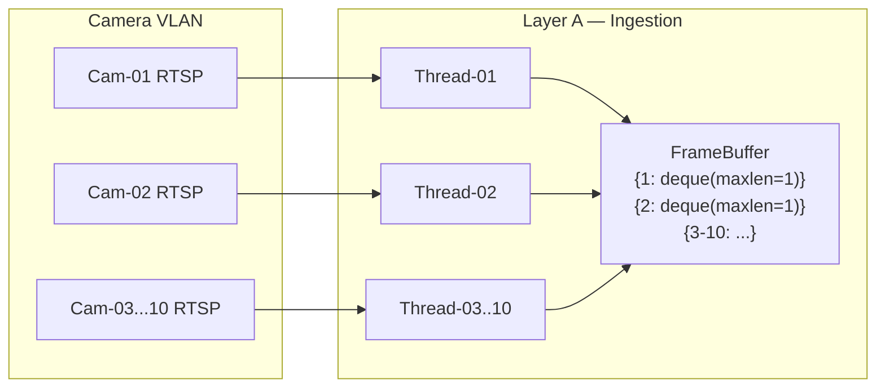
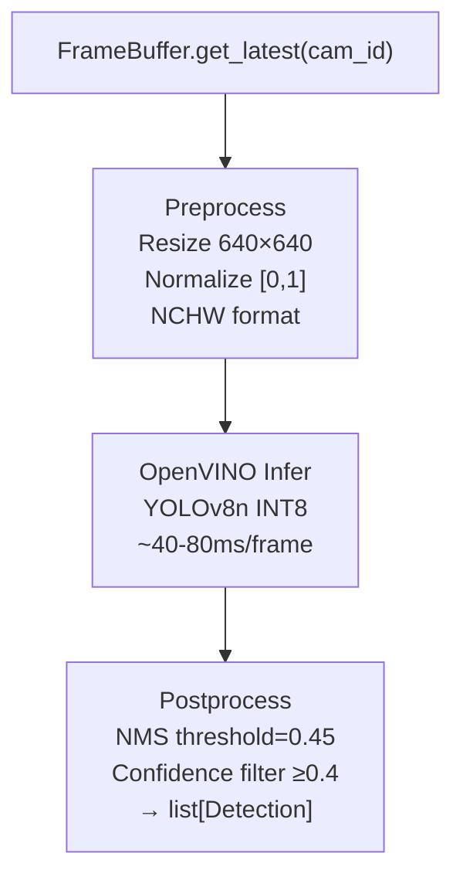
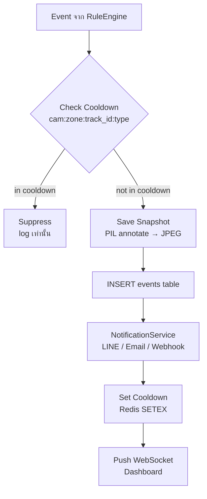

# 02 — System Architecture

---

## 1. ภาพรวม: ระบบแบ่งเป็น 4 Layer

เหตุผลที่แบ่ง 4 Layer ไม่ใช่แค่ความสวยงาม:
- แต่ละ Layer มี **rate ของการเปลี่ยนแปลงที่ต่างกัน** — Hardware เปลี่ยนน้อยที่สุด, Business Logic เปลี่ยนบ่อยที่สุด
- แต่ละ Layer มี **failure mode ต่างกัน** — กล้องดับไม่ควรทำ Dashboard พัง
- แต่ละ Layer สามารถ **Scale ต่างกัน** — เพิ่ม GPU ทำใน Layer B โดยไม่แตะ Layer D

```
┌─────────────────────────────────────────────────────────────────────┐
│                                                                       │
│   [A] DATA INGESTION     ← รับภาพจากกล้อง, buffer ในหน่วยความจำ    │
│          │                                                            │
│          │ Queue (thread-safe deque)                                  │
│          ▼                                                            │
│   [B] AI PROCESSING      ← ตรวจจับวัตถุ + ติดตาม ID                 │
│          │                                                            │
│          │ TrackedObject list                                         │
│          ▼                                                            │
│   [C] RULE ENGINE        ← ตัดสินว่าเกิดเหตุการณ์อะไร               │
│          │                                                            │
│          │ Event + Alert                                              │
│          ▼                                                            │
│   [D] PERSISTENCE & API  ← บันทึก, แจ้งเตือน, แสดงผล               │
│                                                                       │
└─────────────────────────────────────────────────────────────────────┘
```

---

## 2. Layer A — Data Ingestion

**หน้าที่:** เชื่อมต่อกล้องทุกตัว, ดึงเฟรม, เก็บไว้ใน Buffer รอ AI มาดึง

### ปัญหาหลักของ Layer นี้: กล้อง 10 ตัวผลิต ~100 FPS รวม แต่ AI ประมวลผลได้แค่ ~12 FPS

แนวทางแก้: **Producer-Consumer with Frame Dropping**
- กล้องแต่ละตัวรัน Thread ของตัวเอง (Producer) → push เฟรมลง Buffer
- Buffer ใช้ `deque(maxlen=1)` — เฟรมเก่าถูกทิ้งอัตโนมัติเมื่อมีเฟรมใหม่มา
- AI Thread (Consumer) ดึงเฟรม "ล่าสุด" ของกล้องแต่ละตัวตาม Round-robin



### Auto-Reconnect Policy
กล้อง IP เป็นที่รู้กันว่า drop connection ไม่มีเหตุผล:

```
เมื่อ cv2.VideoCapture.read() คืนค่า False
  → ปิด capture
  → รอ backoff_seconds (เริ่มที่ 1s, max 30s, × 2 ทุกครั้ง)
  → เปิด capture ใหม่
  → บันทึก offline event ลง DB
  → ทำซ้ำจนกว่าจะสำเร็จ
```

---

## 3. Layer B — AI Processing

**หน้าที่:** นำเฟรมมา inference ด้วย AI model แล้วส่งผล Detection ให้ Tracker แปลงเป็น TrackedObject

### 3.1 Inference Engine

ใช้ **OpenVINO Runtime** บน CPU เนื่องจาก:
- Intel optimize สำหรับ x86 CPU โดยตรง (เร็วกว่า PyTorch CPU ~3×)
- รองรับ INT8 quantization ลด memory ครึ่งหนึ่ง
- เมื่อมี GPU ในอนาคต เปลี่ยน `device="CPU"` → `device="GPU"` บรรทัดเดียว



### 3.2 Multi-Model Strategy

ระบบรองรับหลาย Model โดยโหลดพร้อมกันในหน่วยความจำ:

```
Model 1: yolov8n_general (primary)
  → detect: person, car, motorcycle, truck, bus, bicycle, dog, cat, bird
  → ใช้กับทุกกล้องตลอดเวลา

Model 2: yolov8_fire (secondary, optional)
  → detect: fire, smoke
  → เปิดใช้เฉพาะกล้องที่กำหนด (เช่น กล้องในโรงงาน)

Model 3: lpr_detector + paddleocr (on-demand)
  → ทำงานเฉพาะเมื่อมี Detection "car" ในโซนที่กำหนด (LPR Zone)
  → ไม่รัน round-robin — รันเพิ่มเฉพาะเมื่อจำเป็น
```

### 3.3 Object Tracker (ByteTrack)

ByteTrack ถูกเลือกเพราะ:
- ทำงานได้ดีกับ occlusion (วัตถุโดนบัง)
- ไม่ต้องใช้ Re-ID model แยก (DeepSORT ต้องการ)
- เร็วกว่า DeepSORT ~5× บน CPU

```
Input  : list[Detection] (x1,y1,x2,y2,conf,class) จากเฟรมปัจจุบัน
Output : list[TrackedObject] (track_id, bbox, class, history[])

Tracker state ต่อ camera_id หนึ่งตัว:
- active_tracks: dict[track_id → Track]
- lost_tracks: tracks ที่หายไป ≤ max_lost_frames (30 frames)
- removed_tracks: tracks ที่ expired
```

---

## 4. Layer C — Rule Engine

**หน้าที่:** รับ TrackedObject → ตรวจสอบว่าละเมิดกฎไหนบ้าง → สร้าง Event

นี่คือ **"สมอง" ของระบบ** — ทุก Business Logic อยู่ที่นี่

### 4.1 โครงสร้างกฎ

กฎทุกข้อมีรูปแบบ:
```
IF  [Object Class] IS IN [Zone]
AND [Behavioral Condition]
AND [Time Schedule is Active]
THEN CREATE Event(type, severity)
```

### 4.2 Behavioral Conditions ที่รองรับ

#### INTRUSION — บุกรุกเข้าโซน
```
Condition  : centroid(TrackedObject.bbox) อยู่ใน Zone polygon
Algorithm  : Shapely Point.within(Polygon)
Trigger    : ทันทีที่ centroid เข้าโซน (first occurrence)
Reset      : เมื่อ centroid ออกจากโซน
```

#### LOITERING — วนเวียนเกินเวลา
```
Condition  : dwell_time > rule.threshold_seconds
Algorithm  : สะสมเวลา (frame_interval × frames_in_zone)
Trigger    : เมื่อ dwell_time แตะ threshold ครั้งแรก
Reset      : เมื่อ track ออกจากโซน หรือ track หาย
```

#### LINE CROSSING — ข้ามเส้น
```
Condition  : Track ข้ามเส้น Tripwire ในทิศที่กำหนด (หรือทั้งสองทิศ)
Algorithm  : Cross product ของ vector (prev_centroid→curr_centroid) กับ (p1→p2)
Trigger    : เมื่อ sign ของ cross product เปลี่ยน
Direction  : "A→B", "B→A", หรือ "BOTH"
```

#### CROWD DENSITY — ความหนาแน่นผิดปกติ
```
Condition  : นับ TrackedObject ประเภทกำหนดที่ centroid อยู่ใน Zone ≥ threshold
Algorithm  : ตรวจสอบทุก Track ต่อเฟรม — นับที่อยู่ใน Zone
Trigger    : จำนวนแตะ threshold (ไม่ใช่เพิ่มขึ้นถึง)
Reset      : จำนวนลดลงต่ำกว่า threshold × 0.8 (hysteresis)
```

#### ABANDONED OBJECT — วัตถุถูกทิ้ง
```
Condition  : Track class == "bag/suitcase/backpack" และ stationary_time > threshold
Algorithm  : ถ้า displacement ระหว่าง N frames ≤ 5px → นับว่า stationary
Trigger    : stationary_time > threshold
Reset      : Track เริ่มเคลื่อนไหวอีกครั้ง
```

### 4.3 Alert Manager — ด่านกรองสุดท้าย



**Cooldown Key Design:**
```
f"cd:{camera_id}:{zone_id}:{track_id}:{event_type}"

ทำไมใส่ track_id: เพื่อให้ "คนเดิม" ที่ยังอยู่ในโซน
ไม่ถูกแจ้งซ้ำ แต่ "คนใหม่" ที่เข้ามา track_id ต่าง
ยังแจ้งได้ปกติ
```

---

## 5. Layer D — Persistence & API

**หน้าที่:** บันทึกข้อมูล, ให้บริการ API, แสดงผล Dashboard real-time

### 5.1 FastAPI Application

```
REST API   : CRUD สำหรับ Cameras, Zones, Rules, Events
WebSocket  : สองช่องทาง
  /ws/stream/{camera_id}  → ส่งเฟรม annotated (JPEG base64) ~5 FPS
  /ws/alerts              → broadcast ทุก Alert JSON ทันที
```

### 5.2 Storage Layout

```
/data/
├── snapshots/
│   └── {YYYY}/{MM}/{DD}/
│       └── ev_{event_id}_{timestamp}.jpg
├── clips/
│   └── {YYYY}/{MM}/{DD}/
│       └── clip_{event_id}.mp4          ← 10 วินาที ก่อน-หลัง event
└── models/
    ├── yolov8n_openvino_int8/
    ├── yolov8_fire_openvino_int8/
    └── lpr_detector_openvino/
```

### 5.3 Deployment: Docker Compose

```yaml
# สรุปโครงสร้าง services
services:
  mtsecurity-core:   # AI Engine + Rule Engine (Python, multi-thread)
  mtsecurity-api:    # FastAPI + WebSocket (Python, async)
  postgres:          # Primary database
  redis:             # Cooldown cache + pubsub
  nginx:             # Reverse proxy + SSL

# Resource limits (สำหรับ Ryzen 7 5700G)
mtsecurity-core:
  cpus: '6.0'        # 6 จาก 8 cores
  memory: 6G

mtsecurity-api:
  cpus: '1.0'
  memory: 1G

postgres:
  cpus: '0.5'
  memory: 512M

redis:
  cpus: '0.5'
  memory: 256M
```

---

## 6. Cross-Cutting Concerns

### Logging Strategy
```
DEBUG   : ทุก inference result (เฉพาะ dev)
INFO    : Camera connect/disconnect, Alert fired
WARNING : Frame drop rate > 50%, Inference > 150ms
ERROR   : Camera reconnect failed, DB write failed
CRITICAL: AI model load failed, OOM condition
```

### Health Checks
```
GET /health
→ {
    "status": "ok" | "degraded" | "down",
    "cameras": {"online": 9, "offline": 1},
    "ai_fps": 11.2,
    "db": "ok",
    "redis": "ok",
    "disk_free_gb": 320.5
  }
```

### Graceful Shutdown
```
SIGTERM →
  1. หยุดรับเฟรมใหม่
  2. รอให้ AI thread ทำ inference ปัจจุบันเสร็จ
  3. Flush Alert queue ที่ยังค้างอยู่
  4. ปิด DB connection pool
  5. Exit
```
