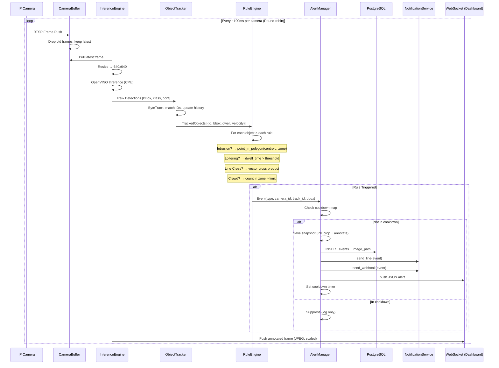
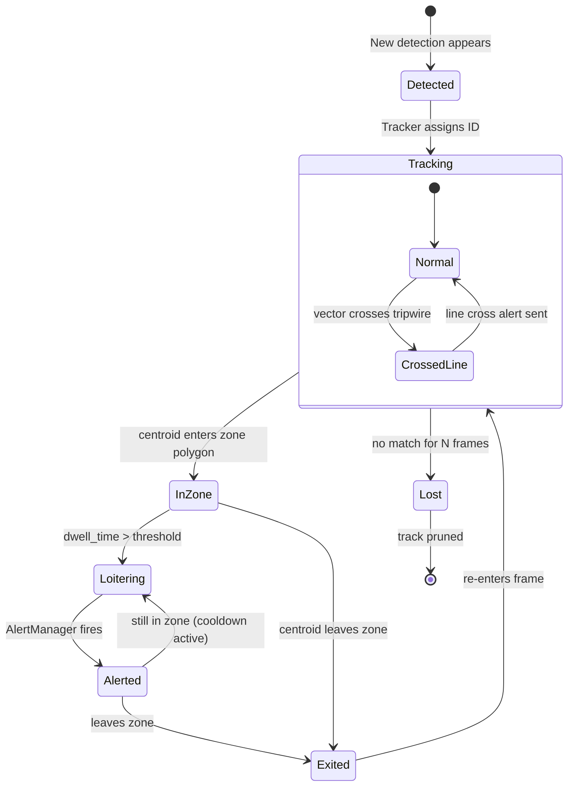
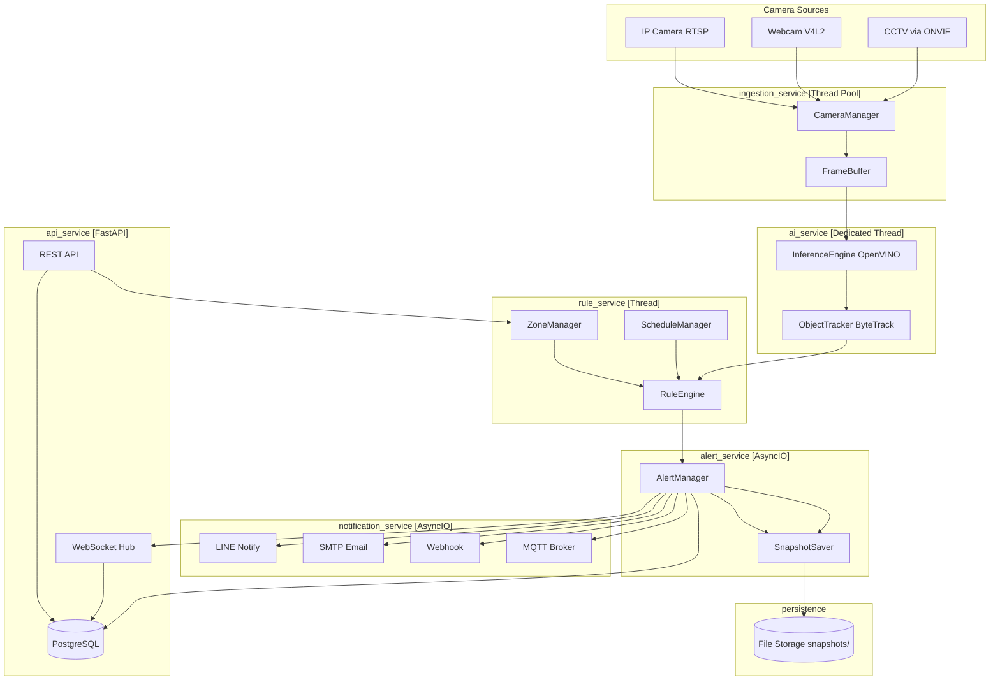

# MTSecurity — Full System Design
## AI-Powered Video Management System (AI-VMS)

> ต่อยอดจาก `01_System_Architecture.md` และ `02_System_Capabilities_and_UseCases.md`  
> เอกสารนี้ครอบคลุม: สถาปัตยกรรมเต็มรูปแบบ, UML Diagrams, Module Structure, Technology Stack, และ Extended Capabilities

---

## 1. Extended Capabilities Matrix

| หมวด | ความสามารถ | Priority | โมเดล / วิธีการ |
|------|-----------|----------|----------------|
| **Detection** | Human / Car / Motorcycle / Truck / Bus / Animal | P0 | YOLOv8n-OpenVINO |
| **Detection** | Fire & Smoke | P1 | YOLOv8-fire (lightweight) |
| **Detection** | Abandoned / Removed Object | P1 | Background subtraction + Tracker |
| **Detection** | Crowd Density (People Count in Zone) | P1 | Head detection + counting |
| **Behavior** | Intrusion (Zone) | P0 | Rule Engine — Point-in-Polygon |
| **Behavior** | Loitering (ค้างในโซน) | P0 | Rule Engine — Dwell Time |
| **Behavior** | Line Crossing (Tripwire + Direction) | P0 | Rule Engine — Vector Crossing |
| **Behavior** | Wrong-Way Vehicle | P1 | Direction vector history |
| **Behavior** | Tailgating Detection | P1 | 2-person proximity + access event |
| **Behavior** | Running / Fast Movement | P2 | Velocity from Tracker |
| **Behavior** | Crowd Gathering (anomalous density) | P1 | Zone density threshold |
| **Smart** | License Plate Recognition (LPR/ANPR) | P1 | PaddleOCR + plate detector |
| **Smart** | PPE Compliance (Hard hat / Vest) | P2 | YOLOv8-ppe |
| **Smart** | Schedule-based Rules (Day/Night Mode) | P0 | Cron scheduler |
| **Smart** | Heat Map & Analytics | P1 | Centroid accumulation |
| **Smart** | Multi-Camera Cross Tracking | P2 | Re-ID embedding |
| **Alert** | Web Dashboard (WebSocket) | P0 | FastAPI + React |
| **Alert** | LINE Notify | P0 | LINE API |
| **Alert** | Email (SMTP) | P0 | smtplib / SendGrid |
| **Alert** | Webhook / REST POST | P1 | httpx async |
| **Alert** | MQTT (IoT/Relay/Siren) | P1 | paho-mqtt |

---

## 2. High-Level System Architecture

```
┌─────────────────────────────────────────────────────────────────────────┐
│                        MTSecurity AI-VMS                                 │
│                                                                           │
│  ┌──────────────┐    ┌──────────────┐    ┌──────────────┐               │
│  │  IP Cameras  │    │   Webcams    │    │  CCTV/DVR    │               │
│  │  (RTSP/H264) │    │  (V4L2/USB)  │    │  (RTSP/ONVIF)│               │
│  └──────┬───────┘    └──────┬───────┘    └──────┬───────┘               │
│         └─────────────────┬─┴──────────────────┘                        │
│                           ▼                                               │
│  ┌────────────────────────────────────────────────────┐                  │
│  │          A. DATA INGESTION LAYER                    │                  │
│  │  ┌──────────────┐  ┌────────────────────────────┐  │                  │
│  │  │ CameraManager│  │   FrameBuffer (Circular)   │  │                  │
│  │  │ RTSP/ONVIF   │─▶│   {cam_id: deque[Frame]}   │  │                  │
│  │  │ Reconnect    │  │   Max: 3 frames/camera      │  │                  │
│  │  └──────────────┘  └───────────────┬────────────┘  │                  │
│  └─────────────────────────────────────┼───────────────┘                  │
│                                        ▼                                  │
│  ┌────────────────────────────────────────────────────┐                  │
│  │          B. AI PROCESSING LAYER                     │                  │
│  │  ┌──────────────────┐    ┌──────────────────────┐  │                  │
│  │  │  ModelManager    │    │   InferenceEngine    │  │                  │
│  │  │  - YOLOv8n       │───▶│   OpenVINO (CPU)     │  │                  │
│  │  │  - YOLOv8-fire   │    │   Round-robin        │  │                  │
│  │  │  - PaddleOCR     │    │   Frame Drop Logic   │  │                  │
│  │  └──────────────────┘    └──────────┬───────────┘  │                  │
│  │                                     ▼               │                  │
│  │                          ┌──────────────────────┐  │                  │
│  │                          │   ObjectTracker      │  │                  │
│  │                          │   ByteTrack/DeepSORT │  │                  │
│  │                          │   → Track ID, Bbox   │  │                  │
│  │                          └──────────┬───────────┘  │                  │
│  └─────────────────────────────────────┼───────────────┘                  │
│                                        ▼                                  │
│  ┌────────────────────────────────────────────────────┐                  │
│  │          C. LOGIC & RULE ENGINE LAYER               │                  │
│  │  ┌──────────────┐  ┌──────────────┐  ┌──────────┐  │                  │
│  │  │  ZoneManager │  │  RuleEngine  │  │ScheduleMgr│  │                  │
│  │  │  - Polygon   │─▶│  - Intrusion │  │ Day/Night │  │                  │
│  │  │  - Tripwire  │  │  - Loitering │◀─│  Rules    │  │                  │
│  │  │  - Heatmap   │  │  - Crossing  │  └──────────┘  │                  │
│  │  └──────────────┘  │  - Abandoned │               │                  │
│  │                    │  - Crowd     │               │                  │
│  │                    │  - LPR Check │               │                  │
│  │                    └──────┬───────┘               │                  │
│  │                           ▼                       │                  │
│  │                    ┌──────────────┐               │                  │
│  │                    │ AlertManager │               │                  │
│  │                    │ Debounce     │               │                  │
│  │                    │ Cooldown     │               │                  │
│  │                    └──────┬───────┘               │                  │
│  └───────────────────────────┼────────────────────────┘                  │
│                              ▼                                            │
│  ┌────────────────────────────────────────────────────┐                  │
│  │       D. PRESENTATION & PERSISTENCE LAYER           │                  │
│  │  ┌──────────┐ ┌──────────┐ ┌──────────┐ ┌───────┐  │                  │
│  │  │ FastAPI  │ │PostgreSQL│ │Snapshots │ │Notif. │  │                  │
│  │  │ REST API │ │ Events   │ │/videos   │ │Service│  │                  │
│  │  │ WebSocket│ │ Cameras  │ │ Storage  │ │LINE   │  │                  │
│  │  │ Dashboard│ │ Zones    │ │          │ │Email  │  │                  │
│  │  └──────────┘ └──────────┘ └──────────┘ │MQTT   │  │                  │
│  │                                          │Webhook│  │                  │
│  │                                          └───────┘  │                  │
│  └────────────────────────────────────────────────────┘                  │
└─────────────────────────────────────────────────────────────────────────┘
```

---

## 3. UML Class Diagram (Core Domain)

```mermaid
classDiagram

    class Camera {
        +int id
        +str name
        +str rtsp_url
        +CameraType type
        +bool is_active
        +connect() bool
        +disconnect()
        +get_frame() Frame
    }

    class Frame {
        +int camera_id
        +ndarray data
        +float timestamp
        +int width
        +int height
    }

    class FrameBuffer {
        -dict[int, deque] _buffers
        -int max_size
        +put(camera_id, frame)
        +get_latest(camera_id) Frame
        +drop_old_frames()
    }

    class InferenceEngine {
        -CompiledModel _model
        -str device
        +load_model(path, device)
        +infer(frame) list[Detection]
        +batch_infer(frames) list[list[Detection]]
    }

    class Detection {
        +int class_id
        +str class_name
        +float confidence
        +BBox bbox
        +dict metadata
    }

    class BBox {
        +float x1
        +float y1
        +float x2
        +float y2
        +centroid() tuple
        +area() float
        +iou(other) float
    }

    class ObjectTracker {
        -dict[int, Track] _tracks
        +update(detections) list[TrackedObject]
    }

    class TrackedObject {
        +int track_id
        +int camera_id
        +str class_name
        +BBox bbox
        +list[tuple] history
        +float dwell_time
        +float velocity
        +Direction direction
    }

    class Zone {
        +int id
        +int camera_id
        +str name
        +ZoneType zone_type
        +list[tuple] polygon
        +contains_point(x, y) bool
        +crosses_line(prev, curr) bool
    }

    class ZoneManager {
        -dict[int, list[Zone]] _zones
        +get_zones(camera_id) list[Zone]
        +check_object_in_zone(obj, zone) bool
        +add_zone(zone)
        +update_heatmap(camera_id, points)
    }

    class Rule {
        +int id
        +int zone_id
        +RuleType rule_type
        +str target_class
        +float threshold
        +TimeSchedule schedule
        +evaluate(tracked_obj) bool
    }

    class RuleEngine {
        -list[Rule] _rules
        -ZoneManager _zone_mgr
        +evaluate_all(camera_id, tracks) list[Event]
        +check_intrusion(obj, zone) Event
        +check_loitering(obj, zone, threshold) Event
        +check_line_crossing(obj, zone) Event
        +check_crowd_density(zone, count) Event
        +check_abandoned_object(obj) Event
    }

    class Event {
        +int id
        +int camera_id
        +int zone_id
        +EventType event_type
        +str object_class
        +int track_id
        +float timestamp
        +str image_path
        +dict extra_data
    }

    class AlertManager {
        -dict _cooldown_map
        +int cooldown_seconds
        +process_event(event) bool
        +is_in_cooldown(key) bool
        +reset_cooldown(key)
    }

    class NotificationService {
        +send_line(event, image_path)
        +send_email(event, image_path)
        +send_webhook(event)
        +send_mqtt(event)
    }

    class ScheduleManager {
        -list _schedules
        +get_active_rules(camera_id) list[Rule]
        +is_active_time(schedule) bool
    }

    Camera "1" --> "many" Frame : produces
    Frame --> FrameBuffer : stored in
    FrameBuffer --> InferenceEngine : feeds
    InferenceEngine --> Detection : returns
    Detection "many" --> "1" BBox : has
    Detection --> ObjectTracker : input to
    ObjectTracker --> TrackedObject : produces
    TrackedObject --> RuleEngine : evaluated by
    Zone --> ZoneManager : managed by
    Rule --> RuleEngine : applied by
    RuleEngine --> Event : generates
    Event --> AlertManager : filtered by
    AlertManager --> NotificationService : triggers
    ScheduleManager --> RuleEngine : configures
```



---

## 4. UML Sequence Diagram (Full Alert Flow)



---

## 5. State Diagram: Tracked Object Lifecycle



---

## 6. UML Component Diagram (Service Boundaries)



---

## 7. Database Schema (Full)

```sql
-- กล้องทั้งหมดในระบบ
CREATE TABLE cameras (
    id          SERIAL PRIMARY KEY,
    name        VARCHAR(100) NOT NULL,
    rtsp_url    TEXT NOT NULL,
    type        VARCHAR(20) DEFAULT 'ip_camera',  -- ip_camera|webcam|cctv
    location    VARCHAR(200),
    status      VARCHAR(20) DEFAULT 'offline',     -- online|offline|error
    fps_target  INT DEFAULT 5,
    created_at  TIMESTAMP DEFAULT NOW()
);

-- โซนและเส้นสมมติ
CREATE TABLE zones (
    id              SERIAL PRIMARY KEY,
    camera_id       INT REFERENCES cameras(id),
    name            VARCHAR(100),
    zone_type       VARCHAR(20) NOT NULL,  -- polygon|tripwire
    polygon_coords  JSONB NOT NULL,        -- [[x,y], [x,y], ...]
    color           VARCHAR(7) DEFAULT '#FF0000',
    is_active       BOOLEAN DEFAULT TRUE
);

-- กฎที่ผูกกับโซน
CREATE TABLE rules (
    id              SERIAL PRIMARY KEY,
    zone_id         INT REFERENCES zones(id),
    rule_type       VARCHAR(30) NOT NULL, -- intrusion|loitering|line_crossing|crowd|abandoned
    target_classes  TEXT[] DEFAULT '{person}',  -- person|car|animal|fire|all
    threshold       FLOAT,               -- seconds (loitering), count (crowd)
    cooldown_sec    INT DEFAULT 300,
    schedule_start  TIME,                -- NULL = always active
    schedule_end    TIME,
    is_active       BOOLEAN DEFAULT TRUE
);

-- เหตุการณ์ที่ตรวจพบ
CREATE TABLE events (
    id              BIGSERIAL PRIMARY KEY,
    camera_id       INT REFERENCES cameras(id),
    zone_id         INT REFERENCES zones(id),
    rule_id         INT REFERENCES rules(id),
    event_type      VARCHAR(30) NOT NULL,
    object_class    VARCHAR(50),
    track_id        INT,
    confidence      FLOAT,
    bbox_json       JSONB,               -- {x1,y1,x2,y2}
    image_path      TEXT,
    video_clip_path TEXT,
    extra_data      JSONB,               -- LPR plate, crowd count, etc.
    timestamp       TIMESTAMP DEFAULT NOW()
);

-- Whitelist (LPR: ทะเบียนรถที่อนุญาต)
CREATE TABLE lpr_whitelist (
    id          SERIAL PRIMARY KEY,
    plate       VARCHAR(20) UNIQUE NOT NULL,
    owner_name  VARCHAR(100),
    notes       TEXT,
    expires_at  TIMESTAMP
);

-- การแจ้งเตือนที่ส่งออกไปแล้ว
CREATE TABLE notifications (
    id          BIGSERIAL PRIMARY KEY,
    event_id    BIGINT REFERENCES events(id),
    channel     VARCHAR(20) NOT NULL,   -- line|email|webhook|mqtt
    status      VARCHAR(20) DEFAULT 'pending',
    sent_at     TIMESTAMP,
    error_msg   TEXT
);

-- Indexes สำหรับ Query performance
CREATE INDEX idx_events_camera_time ON events(camera_id, timestamp DESC);
CREATE INDEX idx_events_type ON events(event_type);
CREATE INDEX idx_events_timestamp ON events(timestamp DESC);
```

---

## 8. Python Module Structure

```
mtsecurity/
├── main.py                      # Entry point, service orchestration
├── config.py                    # Settings (Pydantic BaseSettings)
│
├── ingestion/
│   ├── __init__.py
│   ├── camera_manager.py        # RTSP/V4L2 connection pool
│   ├── frame_buffer.py          # Circular buffer per camera
│   └── onvif_discovery.py       # Auto-discover ONVIF cameras
│
├── ai/
│   ├── __init__.py
│   ├── inference_engine.py      # OpenVINO wrapper, round-robin
│   ├── model_manager.py         # Load/unload/hot-swap models
│   ├── detector.py              # YOLOv8 postprocessing
│   ├── tracker.py               # ByteTrack wrapper
│   ├── lpr.py                   # License plate crop + PaddleOCR
│   └── fire_detector.py         # Fire/smoke specialized model
│
├── rules/
│   ├── __init__.py
│   ├── zone_manager.py          # Polygon/tripwire CRUD
│   ├── rule_engine.py           # Evaluate rules → Events
│   ├── behaviors/
│   │   ├── intrusion.py         # point_in_polygon check
│   │   ├── loitering.py         # dwell_time accumulator
│   │   ├── line_crossing.py     # vector cross product
│   │   ├── crowd.py             # zone density counter
│   │   └── abandoned_object.py  # static object detector
│   └── schedule_manager.py      # Time-based rule activation
│
├── alerts/
│   ├── __init__.py
│   ├── alert_manager.py         # Debounce + cooldown
│   ├── snapshot.py              # PIL annotate + save JPEG
│   └── notifications/
│       ├── line_notify.py
│       ├── email_sender.py
│       ├── webhook_sender.py
│       └── mqtt_publisher.py
│
├── api/
│   ├── __init__.py
│   ├── app.py                   # FastAPI app factory
│   ├── routers/
│   │   ├── cameras.py           # CRUD cameras
│   │   ├── zones.py             # CRUD zones
│   │   ├── rules.py             # CRUD rules
│   │   ├── events.py            # Query events / export
│   │   └── analytics.py        # Heat maps, stats
│   ├── websocket_hub.py         # Broadcast frames + alerts
│   └── dependencies.py         # DB session, auth
│
├── models/                      # SQLAlchemy ORM models
│   ├── camera.py
│   ├── zone.py
│   ├── rule.py
│   ├── event.py
│   └── notification.py
│
├── analytics/
│   ├── heatmap.py               # Centroid accumulator → heatmap PNG
│   ├── statistics.py            # Hourly/daily aggregations
│   └── report_generator.py     # PDF/CSV export
│
└── tests/
    ├── test_rule_engine.py
    ├── test_tracker.py
    └── test_alert_manager.py
```

---

## 9. Deployment Architecture

```mermaid
graph TB
    subgraph "Hardware: Ryzen 7 5700G / 16GB RAM"
        subgraph "Docker Compose (Recommended)"
            SVC[mtsecurity-core<br/>Python 3.11<br/>OpenVINO Runtime]
            API[mtsecurity-api<br/>FastAPI + Uvicorn]
            PG[postgres:15<br/>Port 5432]
            NG[nginx<br/>Port 80/443<br/>SSL Termination]
            RD[redis:7<br/>Alert Cooldown Cache]
        end

        subgraph "Host Volumes"
            VOL1[/data/snapshots]
            VOL2[/data/models]
            VOL3[/data/pgdata]
        end

        SVC --> PG
        SVC --> RD
        API --> PG
        API --> RD
        NG --> API
        SVC --> VOL1
        SVC --> VOL2
        PG --> VOL3
    end

    subgraph "Camera Network (VLAN)"
        CAM1[IP Cam 192.168.10.x]
        CAM2[CCTV/DVR 192.168.10.y]
    end

    subgraph "Clients"
        DASH[Web Dashboard<br/>React + WebSocket]
        MOB[Mobile App<br/>LINE / Email]
    end

    CAM1 & CAM2 -->|RTSP 554| SVC
    DASH -->|HTTPS / WSS| NG
    API -->|LINE API| MOB
```

---

## 10. Performance Budget (Ryzen 7 5700G, No GPU)

| Component | Target | Constraint |
|-----------|--------|-----------|
| RTSP Decode per camera | 10 FPS | OpenCV `cap.read()` + Threading |
| AI Inference per frame | ≤ 80ms | YOLOv8n INT8 via OpenVINO |
| Effective AI FPS (10 cams) | ~1.25 FPS/cam | Round-robin: 80ms × 10 = 800ms cycle |
| Tracker update | ≤ 5ms | ByteTrack Numpy ops |
| Rule evaluation (10 cams × 20 objects) | ≤ 2ms | Pure Python, Shapely point-in-poly |
| Alert + Snapshot save | async | Non-blocking asyncio |
| RAM budget (10 cams × 3 frames) | ~450MB | 640×640 × 3ch × float32 |
| OpenVINO model (INT8) | ~25MB RAM | YOLOv8n quantized |
| **Total RAM estimate** | **~2.5GB** | Leaves ~13GB free for OS + DB |

---

## 11. Key Design Decisions

### 11.1 Frame Drop Strategy
```python
# FrameBuffer จะเก็บแค่ frame ล่าสุดต่อกล้อง
# AI thread pull latest → หากมี frame ใหม่กว่า จะข้าม frame เก่าทันที
def get_latest(self, camera_id: int) -> Optional[Frame]:
    buf = self._buffers.get(camera_id)
    if not buf:
        return None
    # deque(maxlen=1) ensures only latest frame kept
    return buf[-1] if buf else None
```

### 11.2 Point-in-Polygon (Shapely)
```python
from shapely.geometry import Point, Polygon

def check_intrusion(self, centroid: tuple, zone: Zone) -> bool:
    poly = Polygon(zone.polygon_coords)
    pt = Point(centroid)
    return poly.contains(pt)
```

### 11.3 Line Crossing (Vector Cross Product)
```python
def check_line_crossing(self, prev: tuple, curr: tuple,
                         line_start: tuple, line_end: tuple) -> Optional[str]:
    # Returns 'A→B', 'B→A', or None
    d1 = cross_product(line_start, line_end, prev)
    d2 = cross_product(line_start, line_end, curr)
    if d1 * d2 < 0:  # crossed
        return 'A→B' if d1 > 0 else 'B→A'
    return None
```

### 11.4 Debounce / Cooldown (Redis-backed)
```python
async def process_event(self, event: Event) -> bool:
    key = f"cooldown:{event.camera_id}:{event.zone_id}:{event.track_id}:{event.event_type}"
    if await redis.exists(key):
        return False  # suppress duplicate alert
    await redis.setex(key, event.rule.cooldown_sec, "1")
    await self._dispatch(event)
    return True
```

---

## 12. Notification Payload Example (LINE / Webhook)

```json
{
  "event_type": "intrusion",
  "camera_id": 3,
  "camera_name": "ประตูหลัง",
  "zone_name": "โซนอันตราย-เครื่องจักร",
  "object_class": "person",
  "track_id": 42,
  "confidence": 0.87,
  "timestamp": "2026-05-07T23:14:05+07:00",
  "image_url": "https://mtsecurity.local/snapshots/ev_12345.jpg",
  "bbox": {"x1": 310, "y1": 120, "x2": 410, "y2": 390},
  "severity": "HIGH"
}
```

---

## 13. Development Roadmap

### Phase 1 — MVP (สัปดาห์ 1–3)
- [ ] RTSP ingestion + FrameBuffer (10 cameras)
- [ ] YOLOv8n OpenVINO inference (person, car, animal)
- [ ] ByteTrack integration
- [ ] Intrusion + Loitering rules
- [ ] FastAPI + WebSocket live view
- [ ] PostgreSQL schema + Event logging
- [ ] LINE Notify + Snapshot

### Phase 2 — Production Ready (สัปดาห์ 4–6)
- [ ] Web Dashboard (React) — live feed + zone editor
- [ ] Line Crossing / Tripwire
- [ ] Schedule-based rules (Day/Night Mode)
- [ ] Email + Webhook notifications
- [ ] Smart Search (filter events by time, type, camera)
- [ ] Heat maps
- [ ] Docker Compose deployment

### Phase 3 — Advanced Features (สัปดาห์ 7–10)
- [ ] LPR (License Plate Recognition)
- [ ] Fire & Smoke detection
- [ ] Crowd density monitoring
- [ ] Abandoned object detection
- [ ] MQTT integration (relay/siren)
- [ ] Analytics dashboard (daily/weekly stats)
- [ ] PPE Compliance monitoring

---

*เอกสารนี้เป็น Living Document — อัปเดตตาม Phase การพัฒนา*
