# 03 — Domain Model

---

## 1. ภาษาของ Domain (Ubiquitous Language)

ก่อนดู Diagram ต้องเข้าใจคำจำกัดความร่วมกัน:

```
Camera     : แหล่งภาพ มี URL และสถานะ
Frame      : ภาพ 1 เฟรม ณ เวลาหนึ่ง ผูกกับ Camera
Detection  : วัตถุที่ AI เห็นในเฟรมเดียว — ยังไม่มี ID ข้ามเฟรม
Track      : Detection หลายเฟรมที่ Tracker รวมเป็น "วัตถุชิ้นเดียว"
Zone       : พื้นที่หรือเส้นสมมติบนหน้าจอกล้อง — กำหนดโดย Admin
Rule       : เงื่อนไขที่ผูก Zone + ประเภทวัตถุ + พฤติกรรม + Schedule
Event      : สิ่งที่เกิดขึ้นเมื่อ Track ละเมิด Rule (ยังไม่ผ่าน Debounce)
Alert      : Event ที่ผ่าน Debounce แล้ว — พร้อมส่งแจ้งเตือน
Snapshot   : ภาพ JPEG ที่ annotate แล้ว ณ เวลาที่ Alert เกิด
```

---

## 2. Class Diagram

```mermaid
classDiagram

    %% ─── Value Objects ───────────────────────────────────────────
    class BBox {
        +float x1, y1, x2, y2
        +centroid() tuple[float,float]
        +area() float
        +iou(other: BBox) float
        +contains_point(x, y) bool
        +to_dict() dict
    }

    class TimeSchedule {
        +time start_time
        +time end_time
        +list~int~ weekdays
        +is_active_now() bool
    }

    %% ─── Core Entities ────────────────────────────────────────────
    class Camera {
        +int id
        +str name
        +str rtsp_url
        +CameraType type
        +str location
        +bool is_active
        +int fps_target
        +connect() bool
        +disconnect()
        +status() CameraStatus
    }

    class Frame {
        +int camera_id
        +ndarray pixels
        +float captured_at
        +int seq_number
    }

    class Detection {
        +int class_id
        +str class_name
        +float confidence
        +BBox bbox
    }

    class Track {
        +int track_id
        +int camera_id
        +str class_name
        +BBox bbox
        +float first_seen
        +float last_seen
        +deque~BBox~ history
        +float dwell_time
        +float velocity_px_per_sec
        +bool is_stationary
        +centroid() tuple
        +update(bbox, timestamp)
    }

    class Zone {
        +int id
        +int camera_id
        +str name
        +ZoneType type
        +list~tuple~ coords
        +str color_hex
        +bool is_active
        +contains(point) bool
        +is_crossed_by(prev, curr) CrossResult
    }

    class Rule {
        +int id
        +int zone_id
        +RuleType rule_type
        +list~str~ target_classes
        +float threshold
        +int cooldown_seconds
        +int severity
        +TimeSchedule schedule
        +bool is_active
        +is_scheduled_now() bool
    }

    class Event {
        +int id
        +int camera_id
        +int zone_id
        +int rule_id
        +EventType event_type
        +int track_id
        +str object_class
        +float confidence
        +BBox bbox
        +float timestamp
        +dict extra_data
        +str snapshot_path
        +str clip_path
    }

    class Alert {
        +int id
        +Event source_event
        +int severity
        +bool is_sent
        +list~NotificationLog~ notifications
    }

    class LPRWhitelist {
        +int id
        +str plate_number
        +str owner_name
        +datetime expires_at
        +bool is_valid_now() bool
    }

    %% ─── Enumerations ─────────────────────────────────────────────
    class CameraType {
        <<enumeration>>
        IP_CAMERA
        WEBCAM
        CCTV_DVR
    }

    class ZoneType {
        <<enumeration>>
        POLYGON
        TRIPWIRE
    }

    class RuleType {
        <<enumeration>>
        INTRUSION
        LOITERING
        LINE_CROSSING
        CROWD_DENSITY
        ABANDONED_OBJECT
        WRONG_WAY
    }

    class EventType {
        <<enumeration>>
        INTRUSION
        LOITERING
        LINE_CROSSING
        CROWD
        ABANDONED
        FIRE_SMOKE
        LPR_UNKNOWN
        WRONG_WAY
    }

    %% ─── Relationships ────────────────────────────────────────────
    Camera "1" --> "0..*" Zone : has
    Camera --> CameraType
    Zone --> ZoneType
    Zone "1" --> "0..*" Rule : governs
    Rule --> RuleType
    Rule "1" --> "0..1" TimeSchedule : scheduled by
    Frame --> Camera : captured by
    Detection --> BBox : described by
    Detection --> Frame : extracted from
    Track --> BBox : current position
    Track --> Detection : aggregates
    Event --> Zone : occurred in
    Event --> Rule : triggered by
    Event --> Track : subject
    Event --> BBox : at position
    Alert --> Event : wraps
    LPRWhitelist --> Event : referenced by
```



---

## 3. Enumerations ขยายความ

```python
class RuleType(str, Enum):
    INTRUSION       = "intrusion"        # คนเข้าโซนต้องห้าม
    LOITERING       = "loitering"        # อยู่ในโซนเกินเวลา
    LINE_CROSSING   = "line_crossing"    # ข้ามเส้น Tripwire
    CROWD_DENSITY   = "crowd_density"    # คนแออัดเกินกำหนด
    ABANDONED_OBJECT = "abandoned_object" # วางวัตถุทิ้งไว้
    WRONG_WAY       = "wrong_way"        # รถสวนทาง

class Severity(int, Enum):
    LOW      = 1   # แจ้งเตือน Log เท่านั้น
    MEDIUM   = 2   # LINE + Email
    HIGH     = 3   # LINE + Email + MQTT (ไซเรน)
    CRITICAL = 4   # ทุกช่องทาง + โทรศัพท์ (future)
```

---

## 4. Database Schema — SQLAlchemy ORM (SQLite → PostgreSQL portable)

### หลักการออกแบบ Schema
- ใช้ **SQLAlchemy ORM** ทุก table — ไม่เขียน raw SQL (ยกเว้น migration)
- ใช้ **JSON** แทน JSONB/Array เพื่อให้ทำงานกับ SQLite ได้ทันที
- `DateTime(timezone=True)` — SQLite เก็บเป็น ISO8601 string, PostgreSQL เก็บเป็น TIMESTAMPTZ
- ไม่ใช้ Cascade Delete — soft delete ด้วย `is_active = False`
- เปลี่ยน DB ได้ด้วยแก้ `DATABASE_URL` ใน `.env` เท่านั้น

```python
# models/base.py
from datetime import datetime, timezone
from sqlalchemy import MetaData
from sqlalchemy.orm import DeclarativeBase, mapped_column, Mapped
from sqlalchemy import DateTime

NAMING_CONVENTION = {
    "ix": "ix_%(column_0_label)s",
    "uq": "uq_%(table_name)s_%(column_0_name)s",
    "ck": "ck_%(table_name)s_%(constraint_name)s",
    "fk": "fk_%(table_name)s_%(column_0_name)s_%(referred_table_name)s",
    "pk": "pk_%(table_name)s",
}

class Base(DeclarativeBase):
    metadata = MetaData(naming_convention=NAMING_CONVENTION)

def utcnow() -> datetime:
    return datetime.now(timezone.utc)
```

```python
# models/camera.py
from sqlalchemy import String, Integer, Boolean, DateTime, CheckConstraint
from sqlalchemy.orm import Mapped, mapped_column, relationship
from .base import Base, utcnow

class Camera(Base):
    __tablename__ = "cameras"
    __table_args__ = (
        CheckConstraint("fps_target BETWEEN 1 AND 30", name="fps_range"),
        CheckConstraint("type IN ('ip_camera','webcam','cctv_dvr')", name="valid_type"),
    )

    id:         Mapped[int]  = mapped_column(Integer, primary_key=True, autoincrement=True)
    name:       Mapped[str]  = mapped_column(String(100), nullable=False)
    rtsp_url:   Mapped[str]  = mapped_column(String, nullable=False)
    type:       Mapped[str]  = mapped_column(String(20), default="ip_camera")
    location:   Mapped[str | None] = mapped_column(String(200))
    fps_target: Mapped[int]  = mapped_column(Integer, default=5)
    is_active:  Mapped[bool] = mapped_column(Boolean, default=True)
    created_at: Mapped[datetime] = mapped_column(DateTime(timezone=True), default=utcnow)
    updated_at: Mapped[datetime] = mapped_column(DateTime(timezone=True), default=utcnow, onupdate=utcnow)

    zones:  Mapped[list["Zone"]]  = relationship("Zone",  back_populates="camera")
    events: Mapped[list["Event"]] = relationship("Event", back_populates="camera")
```

```python
# models/zone.py
from sqlalchemy import String, Integer, Boolean, DateTime, ForeignKey, JSON
from sqlalchemy.orm import Mapped, mapped_column, relationship
from .base import Base, utcnow

class Zone(Base):
    __tablename__ = "zones"
    __table_args__ = (
        CheckConstraint("zone_type IN ('polygon','tripwire')", name="valid_zone_type"),
    )

    id:        Mapped[int]  = mapped_column(Integer, primary_key=True, autoincrement=True)
    camera_id: Mapped[int]  = mapped_column(ForeignKey("cameras.id"), nullable=False, index=True)
    name:      Mapped[str]  = mapped_column(String(100), nullable=False)
    zone_type: Mapped[str]  = mapped_column(String(20), nullable=False)
    # JSON แทน JSONB — portable ระหว่าง SQLite และ PostgreSQL
    # coords: [[x,y],[x,y],...] normalized 0.0–1.0
    coords:    Mapped[list] = mapped_column(JSON, nullable=False)
    color_hex: Mapped[str]  = mapped_column(String(7), default="#FF0000")
    is_active: Mapped[bool] = mapped_column(Boolean, default=True)
    created_at: Mapped[datetime] = mapped_column(DateTime(timezone=True), default=utcnow)

    camera: Mapped["Camera"]    = relationship("Camera", back_populates="zones")
    rules:  Mapped[list["Rule"]] = relationship("Rule",  back_populates="zone")
```

```python
# models/rule.py
from sqlalchemy import String, Integer, Float, Boolean, DateTime, ForeignKey, JSON
from sqlalchemy.orm import Mapped, mapped_column, relationship
from .base import Base, utcnow

class Rule(Base):
    __tablename__ = "rules"
    __table_args__ = (
        CheckConstraint("cooldown_sec >= 10",         name="min_cooldown"),
        CheckConstraint("severity BETWEEN 1 AND 4",   name="valid_severity"),
    )

    id:            Mapped[int]       = mapped_column(Integer, primary_key=True, autoincrement=True)
    zone_id:       Mapped[int]       = mapped_column(ForeignKey("zones.id"), nullable=False)
    rule_type:     Mapped[str]       = mapped_column(String(30), nullable=False)
    # target_classes เก็บเป็น JSON list เช่น ["person","car"]
    # ใช้ JSON แทน TEXT[] ของ PostgreSQL เพื่อ SQLite compatibility
    target_classes: Mapped[list]     = mapped_column(JSON, default=lambda: ["person"])
    threshold:     Mapped[float | None] = mapped_column(Float)
    cooldown_sec:  Mapped[int]       = mapped_column(Integer, default=300)
    severity:      Mapped[int]       = mapped_column(Integer, default=2)
    direction:     Mapped[str | None] = mapped_column(String(10))   # 'A→B'|'B→A'|'BOTH'
    schedule_start: Mapped[str | None] = mapped_column(String(5))   # "HH:MM"
    schedule_end:   Mapped[str | None] = mapped_column(String(5))   # "HH:MM"
    # schedule_days: [0,1,2,3,4,5,6] — 0=Mon, 6=Sun; null=ทุกวัน
    schedule_days:  Mapped[list | None] = mapped_column(JSON)
    is_active:     Mapped[bool]      = mapped_column(Boolean, default=True)
    created_at:    Mapped[datetime]  = mapped_column(DateTime(timezone=True), default=utcnow)

    zone: Mapped["Zone"] = relationship("Zone", back_populates="rules")
```

```python
# models/event.py
from sqlalchemy import String, Integer, Float, Boolean, DateTime, ForeignKey, JSON, BigInteger
from sqlalchemy.orm import Mapped, mapped_column, relationship
from sqlalchemy import Index
from .base import Base, utcnow

class Event(Base):
    __tablename__ = "events"

    id:           Mapped[int]  = mapped_column(BigInteger, primary_key=True, autoincrement=True)
    camera_id:    Mapped[int]  = mapped_column(ForeignKey("cameras.id"), nullable=False)
    zone_id:      Mapped[int | None] = mapped_column(ForeignKey("zones.id"))
    rule_id:      Mapped[int | None] = mapped_column(ForeignKey("rules.id"))
    event_type:   Mapped[str]  = mapped_column(String(30), nullable=False)
    track_id:     Mapped[int | None] = mapped_column(Integer)
    object_class: Mapped[str | None] = mapped_column(String(50))
    confidence:   Mapped[float | None] = mapped_column(Float)
    # bbox: {"x1": 0.0, "y1": 0.0, "x2": 1.0, "y2": 1.0}
    bbox:         Mapped[dict | None] = mapped_column(JSON)
    dwell_time:   Mapped[float | None] = mapped_column(Float)
    # extra_data: {"plate": "กข1234", "crowd_count": 8, ...}
    extra_data:   Mapped[dict | None] = mapped_column(JSON)
    snapshot_path: Mapped[str | None] = mapped_column(String)
    clip_path:    Mapped[str | None] = mapped_column(String)
    is_alerted:   Mapped[bool] = mapped_column(Boolean, default=False)
    occurred_at:  Mapped[datetime] = mapped_column(
        DateTime(timezone=True), default=utcnow, index=True
    )

    camera: Mapped["Camera"] = relationship("Camera", back_populates="events")
    notifications: Mapped[list["Notification"]] = relationship("Notification", back_populates="event")

    __table_args__ = (
        Index("ix_events_camera_occurred", "camera_id", "occurred_at"),
        Index("ix_events_type_occurred",   "event_type", "occurred_at"),
    )
```

```python
# models/notification.py
from sqlalchemy import String, Integer, DateTime, ForeignKey, BigInteger
from sqlalchemy.orm import Mapped, mapped_column, relationship
from sqlalchemy import CheckConstraint
from .base import Base

class Notification(Base):
    __tablename__ = "notifications"
    __table_args__ = (
        CheckConstraint("channel IN ('line','email','webhook','mqtt')", name="valid_channel"),
        CheckConstraint("status IN ('pending','sent','failed')",        name="valid_status"),
    )

    id:          Mapped[int] = mapped_column(BigInteger, primary_key=True, autoincrement=True)
    event_id:    Mapped[int] = mapped_column(ForeignKey("events.id"), nullable=False, index=True)
    channel:     Mapped[str] = mapped_column(String(20), nullable=False)
    status:      Mapped[str] = mapped_column(String(20), default="pending")
    sent_at:     Mapped[datetime | None] = mapped_column(DateTime(timezone=True))
    error_msg:   Mapped[str | None]      = mapped_column(String)
    retry_count: Mapped[int]             = mapped_column(Integer, default=0)

    event: Mapped["Event"] = relationship("Event", back_populates="notifications")
```

```python
# models/lpr_whitelist.py
from sqlalchemy import String, Integer, Boolean, DateTime
from sqlalchemy.orm import Mapped, mapped_column
from .base import Base, utcnow

class LPRWhitelist(Base):
    __tablename__ = "lpr_whitelist"

    id:         Mapped[int]  = mapped_column(Integer, primary_key=True, autoincrement=True)
    plate:      Mapped[str]  = mapped_column(String(20), unique=True, nullable=False)
    owner_name: Mapped[str | None] = mapped_column(String(100))
    notes:      Mapped[str | None] = mapped_column(String)
    expires_at: Mapped[datetime | None] = mapped_column(DateTime(timezone=True))
    is_active:  Mapped[bool] = mapped_column(Boolean, default=True)
    created_at: Mapped[datetime] = mapped_column(DateTime(timezone=True), default=utcnow)

    def is_valid_now(self) -> bool:
        if not self.is_active:
            return False
        if self.expires_at is None:
            return True
        return utcnow() < self.expires_at
```

### SQLite-specific Setup (db/session.py)

```python
# db/session.py
from sqlalchemy.ext.asyncio import create_async_engine, async_sessionmaker, AsyncSession
from sqlalchemy import event
from config import Settings

settings = Settings()

engine = create_async_engine(
    settings.database_url,
    echo=settings.db_echo,
    # SQLite-specific: เปิด WAL mode เพื่อให้ reader ไม่ block writer
    connect_args={"check_same_thread": False} if "sqlite" in settings.database_url else {},
)

# เปิด PRAGMA สำคัญทันทีที่ connection ถูกสร้าง
if "sqlite" in settings.database_url:
    @event.listens_for(engine.sync_engine, "connect")
    def set_sqlite_pragma(dbapi_connection, _):
        cursor = dbapi_connection.cursor()
        cursor.execute("PRAGMA journal_mode=WAL")
        cursor.execute("PRAGMA foreign_keys=ON")
        cursor.execute("PRAGMA synchronous=NORMAL")
        cursor.execute("PRAGMA busy_timeout=5000")
        cursor.close()

AsyncSessionLocal = async_sessionmaker(
    engine,
    class_=AsyncSession,
    expire_on_commit=False,
)

async def get_db():
    async with AsyncSessionLocal() as session:
        yield session
```

---

## 5. Data Contracts (API Payloads)

### 5.1 TrackedObject — ส่งจาก AI Layer → Rule Engine

```python
@dataclass
class TrackedObject:
    track_id:     int
    camera_id:    int
    class_name:   str           # "person" | "car" | "motorcycle" | ...
    confidence:   float         # 0.0 – 1.0
    bbox:         BBox
    first_seen:   float         # unix timestamp
    last_seen:    float
    dwell_time:   float         # วินาที สะสมใน Zone ปัจจุบัน
    velocity:     float         # pixel/second
    is_stationary: bool         # True ถ้า velocity < 5 px/s นาน > 3s
    history:      deque[BBox]   # 30 frames ย้อนหลัง
```

### 5.2 Alert Payload — ส่งออกไปทุก Channel

```python
@dataclass
class AlertPayload:
    alert_id:     int
    event_type:   str           # "intrusion" | "loitering" | ...
    severity:     int           # 1-4
    camera_id:    int
    camera_name:  str
    zone_name:    str
    object_class: str
    track_id:     int
    confidence:   float
    occurred_at:  str           # ISO8601 with timezone
    snapshot_url: str           # https://host/snapshots/ev_xxx.jpg
    bbox:         dict          # {x1,y1,x2,y2}
    extra:        dict          # event-specific data
```

### 5.3 WebSocket Frame Message — ส่งไป Dashboard

```json
{
  "type": "frame",
  "camera_id": 3,
  "timestamp": 1746614400.123,
  "frame_b64": "...",
  "tracks": [
    {
      "track_id": 42,
      "class_name": "person",
      "bbox": {"x1": 310, "y1": 120, "x2": 410, "y2": 390},
      "in_zone": ["โซนอันตราย-A"],
      "dwell_time": 47.3,
      "flags": ["loitering"]
    }
  ]
}
```

### 5.4 WebSocket Alert Message — Broadcast ทันที

```json
{
  "type": "alert",
  "alert_id": 1234,
  "event_type": "intrusion",
  "severity": 3,
  "camera_id": 3,
  "camera_name": "ประตูหลัง",
  "zone_name": "โซนเครื่องจักร",
  "object_class": "person",
  "track_id": 42,
  "confidence": 0.87,
  "occurred_at": "2026-05-07T23:14:05+07:00",
  "snapshot_url": "/snapshots/2026/05/07/ev_1234.jpg",
  "extra": {}
}
```
