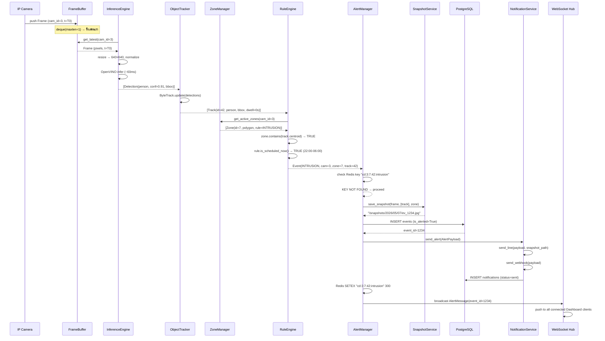
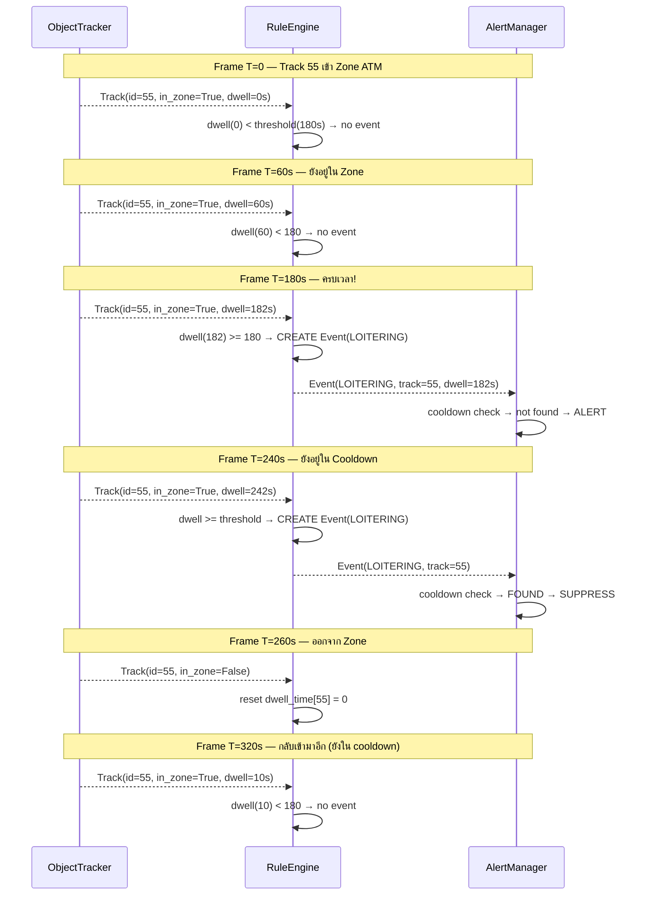
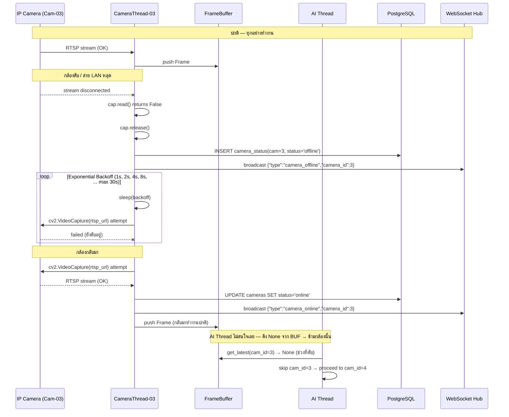
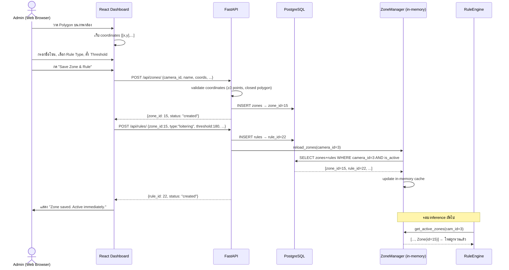
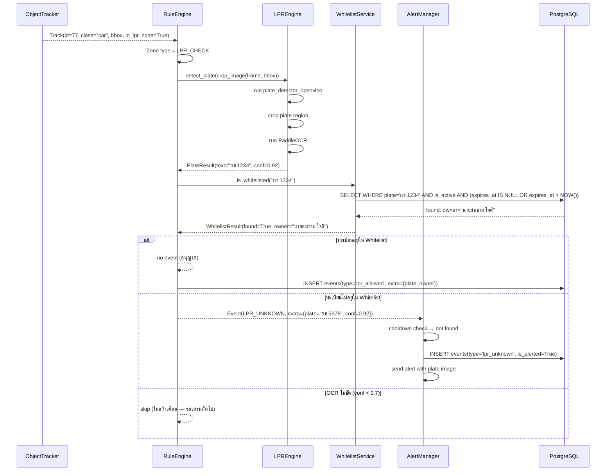

# 04 — Key Flows (Sequence Diagrams)

เอกสารนี้แสดง 5 เส้นทางวิกฤตที่ต้องเข้าใจให้ถ่องแท้ก่อนลงมือเขียนโค้ด

---

## Flow 1: Normal Detection → Intrusion Alert

เส้นทางที่เกิดบ่อยที่สุด — กล้องเห็นคน → AI ตรวจจับ → ละเมิดกฎ → แจ้งเตือน



**จุดที่ต้องระวัง:**
- ขั้นตอน SNAP → DB → NS → Redis ทำใน async coroutine — ไม่ block AI thread
- ถ้า LINE API timeout → บันทึก notification status=failed, retry ใน background

---

## Flow 2: Loitering Detection (Time-accumulation)

Loitering ต่างจาก Intrusion ตรงที่ไม่ trigger ทันที — ต้องสะสมเวลา



**Key Implementation Detail:**

```python
# dwell_time เป็น property ของ Track ที่สะสมเฉพาะตอนอยู่ใน zone นั้น
# ถ้าออกจาก zone → reset dwell สำหรับ zone นั้น
# ถ้า track หาย (lost) → reset ทุก zone

class DwellTracker:
    def __init__(self):
        self._dwell: dict[tuple[int,int], float] = {}
        # key = (track_id, zone_id), value = accumulated seconds

    def update(self, track_id, zone_id, in_zone: bool, dt: float):
        key = (track_id, zone_id)
        if in_zone:
            self._dwell[key] = self._dwell.get(key, 0.0) + dt
        else:
            self._dwell.pop(key, None)
        return self._dwell.get(key, 0.0)
```

---

## Flow 3: Camera Disconnect & Reconnect

ทดสอบว่าระบบ Resilient จริงไหม — กล้องดับแล้วฟื้นคืนมา



---

## Flow 4: Admin กำหนด Zone และ Rule ใหม่ผ่าน Web UI



**ทำไม Reload ทันที ไม่รอ restart:**
Zone Manager เก็บ cache in-memory และ reload เมื่อ API สั่ง
ทำให้ Admin สามารถ fine-tune กฎ แล้วเห็นผลทันทีโดยไม่ต้อง restart service

---

## Flow 5: LPR — ตรวจสอบทะเบียนรถ



**Note:** LPR รัน **เพิ่มเติม** จาก main detection pipeline เฉพาะเมื่อมี "car" ใน LPR Zone
ไม่กระทบ throughput ของกล้องอื่น เพราะรันใน thread แยก
