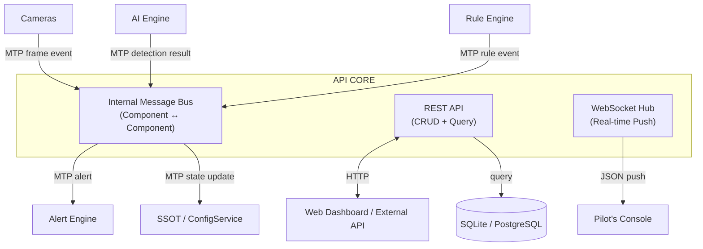

# 01 — Architecture Manifesto
### OSI-Inspired Multitier · API as Core · Loose Coupling by Design

---

## 1. ทำไมต้อง Manifesto ไม่ใช่แค่ Diagram

Architecture diagram บอก "ระบบมีอะไรบ้าง"
Manifesto บอก "ระบบคิดอย่างไร"

ถ้าทีมไม่เข้าใจ WHY เมื่อเจอสถานการณ์ที่ diagram ไม่ครอบคลุม
พวกเขาจะตัดสินใจผิด — เพราะไม่รู้ว่าอะไรคือ principle ที่ต้องรักษา

เอกสารนี้คือ **เหตุผลที่ทำให้ทุกการตัดสินใจมีคำตอบ**

---

## 2. สามกฎเหล็กของระบบนี้

```
กฎ 1: ทุก component สื่อสารผ่าน API Core เท่านั้น
       ไม่มี direct method call ข้าม service boundary

กฎ 2: ทุก layer รู้จักแค่ layer ที่ติดกัน
       Layer 5 ไม่รู้จัก Layer 2 — ต้องผ่าน Layer 3, 4 เสมอ

กฎ 3: SSOT เป็นคนเดียวที่ถือ "ความจริง"
       component ไม่เก็บ config/state ของตัวเอง — subscribe จาก SSOT
```

---

## 3. OSI-Inspired Architecture (7 Layers)

OSI model ถูกออกแบบมาเพื่อแก้ปัญหาที่ระบบนี้เผชิญเหมือนกัน:
**"ทำให้ส่วนต่างๆ ที่ทำหน้าที่ต่างกัน สื่อสารกันได้โดยไม่รู้จักรายละเอียดของกันและกัน"**

```
┌─────────────────────────────────────────────────────────────────┐
│  L7  APPLICATION LAYER    Business Logic, Use Cases, Rules      │
│       ↕ MTP Message                                              │
│  L6  PRESENTATION LAYER   API Contracts, Serialization (JSON)   │
│       ↕ MTP Message                                              │
│  L5  SESSION LAYER        Track State, Dwell Time, ID Registry  │
│       ↕ MTP Message                                              │
│  L4  TRANSPORT LAYER      Message Bus, Queue, Delivery Guarantee│
│       ↕ MTP Message                                              │
│  L3  NETWORK LAYER        Service Registry, Routing, Discovery  │
│       ↕ MTP Message                                              │
│  L2  DATA LINK LAYER      Frame Encoding, Protocol Framing      │
│       ↕ Raw data                                                 │
│  L1  PHYSICAL LAYER       Camera Streams, RTSP, USB, Network    │
└─────────────────────────────────────────────────────────────────┘
```

### ความรับผิดชอบแต่ละ Layer ในระบบนี้

| Layer | ชื่อ | รับผิดชอบ | Component |
|-------|------|----------|-----------|
| L7 | Application | Rule evaluation, Alert decision, Use case execution | RuleEngine, AlertManager |
| L6 | Presentation | JSON serialization, Pydantic validation, API schema | FastAPI, Pydantic Schemas |
| L5 | Session | Track lifecycle, Dwell accumulation, Camera session state | ObjectTracker, DwellTracker, SessionRegistry |
| L4 | Transport | Message delivery, Queue, Retry, TTL | MessageBus (internal) |
| L3 | Network | Service registration, Health check, Config routing | ServiceRegistry, ConfigService |
| L2 | Data Link | Frame encoding, JPEG compression, Protocol framing | FrameCodec, MTP Framer |
| L1 | Physical | RTSP connection, Camera thread, Frame capture | CameraThread, FrameBuffer |

### กฎที่ enforce ตาม OSI

```
✓ L7 (Rules) รับข้อมูลจาก L5 (Tracks) ผ่าน L4 (Bus) เท่านั้น
✓ L5 (Tracker) ไม่รู้จัก L7 (Rules) — ไม่มี import
✓ L1 (Camera) ไม่รู้จัก L3 ขึ้นไป — push frame แล้วจบ
✗ ห้าม: RuleEngine.evaluate(CameraThread.frame) โดยตรง
✗ ห้าม: AlertManager import InferenceEngine
```

---

## 4. API as Core — ศูนย์กลางแห่งการสื่อสาร

### ความแตกต่างจาก "API as Presentation Layer" (แบบเดิม)

```
แบบเดิม (API = ปลายสุด):
  Camera → AI → Rules → Alert → [API] → Client
  API เป็นแค่ window ให้ Client มองเข้ามา

แบบใหม่ (API = Core):
  Camera ──→ [API CORE] ←── Client
  AI     ──→ [API CORE] ←── Dashboard
  Rules  ──→ [API CORE] ←── External System
  Alert  ──→ [API CORE] ←── MQTT Device
  
  ทุกอย่างพูดคุยผ่าน API Core
  ไม่มีใคร "ต่อตรง" กัน
```

### API Core ประกอบด้วย 3 ส่วน



### ประโยชน์ที่ได้จาก API as Core

```
1. Observability ทันที
   ทุก message ผ่าน bus → log ได้ทุก interaction
   ไม่มี "silent" communication ที่ invisible

2. Test ง่ายขึ้นมาก
   Mock Bus → inject fake message → ทดสอบ component เดี่ยวได้
   ไม่ต้อง start ทั้งระบบ

3. Replace ง่าย
   เปลี่ยน AI Engine ใหม่ → ยังส่ง MTP message เหมือนเดิม
   Rule Engine ไม่รู้ด้วยซ้ำว่า AI เปลี่ยน

4. External Integration
   ระบบภายนอก subscribe Bus → ได้ event เหมือน internal component
```

---

## 5. Loose Coupling Matrix

แสดงว่า component ไหน "รู้จัก" กันบ้าง (✓ = รู้จัก, ✗ = ไม่รู้จัก)

```
              Camera  AI   Tracker  Rules  Alert  API   SSOT
Camera          —      ✗     ✗       ✗      ✗     ✗     ✓
AI Engine       ✗      —     ✓       ✗      ✗     ✗     ✓
Tracker         ✗      ✓     —       ✗      ✗     ✗     ✓
Rule Engine     ✗      ✗     ✗       —      ✗     ✓     ✓
Alert Engine    ✗      ✗     ✗       ✗      —     ✓     ✓
API Core        ✓      ✓     ✓       ✓      ✓     —     ✓
SSOT            ✗      ✗     ✗       ✗      ✗     ✓     —

✓ = dependency (A รู้จัก B — A import B หรือ A call B)
ทุก component รู้จัก SSOT (เพื่อ read config)
ทุก component รู้จัก API Core (เพื่อ publish/subscribe message)
ไม่มี component รู้จักกันโดยตรง ยกเว้นที่ explicitly ระบุ
```

---

## 6. Tier Definitions

ระบบแบ่งเป็น **5 Tiers** (แยก Deployment ได้อิสระ):

```
┌─────────────────────────────────────────────────────────┐
│  TIER 1: EDGE / PHYSICAL                                 │
│  IP Cameras, Webcams, CCTV                               │
│  Protocol: RTSP, ONVIF, V4L2                             │
├─────────────────────────────────────────────────────────┤
│  TIER 2: PROCESSING ENGINE                               │
│  Ingestion + AI + Tracker (CPU-intensive)                │
│  Language: Python threads, OpenVINO                      │
├─────────────────────────────────────────────────────────┤
│  TIER 3: API CORE + RULE ENGINE                          │
│  FastAPI, Message Bus, Rule evaluation                   │
│  Language: Python asyncio                                │
├─────────────────────────────────────────────────────────┤
│  TIER 4: PERSISTENCE + SSOT                              │
│  SQLite/PostgreSQL, Redis, File storage                  │
│  Protocol: SQL, Redis Protocol                           │
├─────────────────────────────────────────────────────────┤
│  TIER 5: PRESENTATION                                    │
│  Pilot's Console (React), Mobile (LINE)                  │
│  Protocol: HTTPS, WebSocket, LINE API                    │
└─────────────────────────────────────────────────────────┘

ทิศทาง dependency: Tier สูงขึ้นอยู่กับ Tier ต่ำลง
Tier 5 → Tier 3 (API) → Tier 4 (DB)
Tier 2 → Tier 3 (publish events)
ไม่มี Tier ต่ำกว่า depend on Tier สูงกว่า
```

---

## 7. Failure Isolation

ความสำเร็จที่แท้จริงของ architecture นี้วัดจาก:
**"เมื่อส่วนหนึ่งพัง — ส่วนอื่นยังทำงานได้มากที่สุดเท่าที่เป็นไปได้"**

```
กรณี: AI Engine หยุดทำงาน
  ✓ Camera ยังรับ stream ได้
  ✓ API ยังตอบ REST query ได้
  ✓ Pilot's Console ยังแสดง historical events ได้
  ✓ Alerts ที่ค้างใน queue ยังถูก process เมื่อ AI กลับมา
  ✗ Real-time detection หยุดชั่วคราว (ยอมรับได้)

กรณี: Database ล้มเหลว
  ✓ AI ยังทำงานต่อ (in-memory)
  ✓ LINE alerts ยังส่งออกได้ (notifications ไม่ขึ้นกับ DB write)
  ✗ Events ไม่ถูกบันทึก (ยอมรับได้ชั่วคราว)
  ✗ API query ล้มเหลว

กรณี: กล้องตัวที่ 3 ดับ
  ✓ กล้อง 1-2, 4-10 ทำงานปกติ ไม่มีผลกระทบ
  ✓ API รายงานสถานะ camera_id=3 = "offline"
  ✓ Auto-reconnect ทำงานเบื้องหลัง
```
