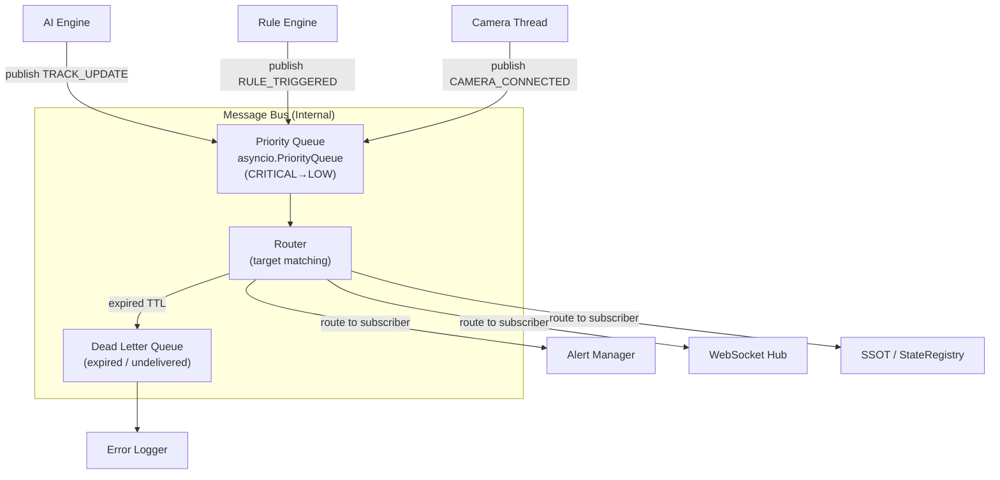

# 02 — Communication Architecture
### MTP (MTSecurity Transport Protocol) · Internal Message Bus · Event Schema

---

## 1. ทำไมต้อง Custom Protocol

ระบบนี้มี 3 ประเภทการสื่อสารที่ต่างกัน:

```
ประเภท 1: External Client ↔ API Core
  → ใช้ HTTP REST + WebSocket (standard — ไม่ต้อง custom)

ประเภท 2: Component ↔ Component (internal)
  → ต้องการ: tracing, priority, TTL, routing, correlation
  → ไม่มี standard ที่ fit พอดี → ออกแบบ MTP

ประเภท 3: API Core → External Notification
  → ใช้ LINE API, SMTP, MQTT (standard — ไม่ต้อง custom)
```

**MTP คือ internal envelope เท่านั้น** — ไม่ใช่ transport protocol ใหม่
ยังใช้ Python queue / asyncio / Redis pub-sub เป็น transport
แต่ทุก message ถูก wrap ด้วย MTP envelope ก่อนเสมอ

---

## 2. MTP — MTSecurity Transport Protocol

### 2.1 Message Envelope (v1.0)

```python
# protocol/mtp.py
from dataclasses import dataclass, field
from enum import Enum
from uuid import uuid4
import time

class MTPPriority(int, Enum):
    LOW      = 1   # Analytics, stats update
    NORMAL   = 2   # Detection results, zone updates
    HIGH     = 3   # Rule trigger, alert candidate
    CRITICAL = 4   # Fire/smoke detection, system error

class MTPMsgType(str, Enum):
    # ── Ingestion Layer ──────────────────────
    CAMERA_CONNECTED    = "camera.connected"
    CAMERA_DISCONNECTED = "camera.disconnected"
    FRAME_READY         = "frame.ready"

    # ── AI Layer ────────────────────────────
    DETECTION_RESULT    = "ai.detection_result"
    TRACK_UPDATE        = "ai.track_update"
    TRACK_LOST          = "ai.track_lost"

    # ── Rule Layer ───────────────────────────
    RULE_TRIGGERED      = "rule.triggered"
    ZONE_ENTERED        = "rule.zone_entered"
    ZONE_EXITED         = "rule.zone_exited"

    # ── Alert Layer ──────────────────────────
    ALERT_FIRED         = "alert.fired"
    ALERT_SUPPRESSED    = "alert.suppressed"
    ALERT_ACK           = "alert.acknowledged"

    # ── System ───────────────────────────────
    CONFIG_CHANGED      = "system.config_changed"
    HEALTH_BEAT         = "system.health_beat"
    SERVICE_REGISTERED  = "system.service_registered"

@dataclass
class MTPMessage:
    msg_type:       MTPMsgType
    payload:        dict

    # Auto-generated fields
    msg_id:         str   = field(default_factory=lambda: str(uuid4()))
    timestamp:      float = field(default_factory=time.time)

    # Routing
    source:         str   = ""       # "ai.inference_engine", "rule.intrusion"
    target:         str   = "*"      # "*" = broadcast, หรือ service name

    # Quality of service
    priority:       MTPPriority = MTPPriority.NORMAL
    ttl:            float = 10.0     # seconds — message expires after TTL
    correlation_id: str   = ""       # trace request chain

    def is_expired(self) -> bool:
        return time.time() > (self.timestamp + self.ttl)

    def to_dict(self) -> dict:
        return {
            "mtp_version":    "1.0",
            "msg_id":         self.msg_id,
            "msg_type":       self.msg_type.value,
            "source":         self.source,
            "target":         self.target,
            "priority":       self.priority.value,
            "timestamp":      self.timestamp,
            "ttl":            self.ttl,
            "correlation_id": self.correlation_id,
            "payload":        self.payload,
        }

    @classmethod
    def from_dict(cls, data: dict) -> "MTPMessage":
        return cls(
            msg_type       = MTPMsgType(data["msg_type"]),
            payload        = data["payload"],
            msg_id         = data["msg_id"],
            timestamp      = data["timestamp"],
            source         = data.get("source", ""),
            target         = data.get("target", "*"),
            priority       = MTPPriority(data.get("priority", 2)),
            ttl            = data.get("ttl", 10.0),
            correlation_id = data.get("correlation_id", ""),
        )
```

### 2.2 Payload Schemas ต่อ Message Type

```python
# protocol/payloads.py — typed payload ต่อ msg_type

# FRAME_READY
{
    "camera_id":   int,
    "seq":         int,
    "width":       int,
    "height":      int,
    "captured_at": float,
    # frame pixels ไม่อยู่ใน payload — อ้างอิงผ่าน FrameBuffer
}

# DETECTION_RESULT
{
    "camera_id":   int,
    "frame_seq":   int,
    "detections": [
        {
            "class_id":   int,
            "class_name": str,
            "confidence": float,
            "bbox":       {"x1": float, "y1": float, "x2": float, "y2": float}
        }
    ],
    "inference_ms": float,
}

# TRACK_UPDATE
{
    "camera_id":    int,
    "tracks": [
        {
            "track_id":     int,
            "class_name":   str,
            "confidence":   float,
            "bbox":         {"x1": float, "y1": float, "x2": float, "y2": float},
            "dwell_time":   float,
            "velocity":     float,
            "is_stationary": bool,
            "history_len":  int,
        }
    ]
}

# RULE_TRIGGERED
{
    "rule_id":      int,
    "rule_type":    str,        # "intrusion"|"loitering"|...
    "camera_id":    int,
    "zone_id":      int,
    "zone_name":    str,
    "track_id":     int,
    "object_class": str,
    "confidence":   float,
    "bbox":         dict,
    "dwell_time":   float,
    "extra":        dict,       # rule-specific data
}

# ALERT_FIRED
{
    "event_id":     int,        # DB primary key
    "rule_type":    str,
    "severity":     int,
    "camera_id":    int,
    "camera_name":  str,
    "zone_name":    str,
    "object_class": str,
    "track_id":     int,
    "occurred_at":  str,        # ISO8601
    "snapshot_url": str,
    "bbox":         dict,
    "channels_sent": list[str], # ["line","webhook"]
}

# CONFIG_CHANGED
{
    "scope":        str,        # "zone"|"rule"|"camera"|"global"
    "entity_id":    int,        # zone_id, rule_id, etc.
    "changed_by":   str,        # actor identifier
    "changes":      dict,       # {"field": {"old": x, "new": y}}
}

# HEALTH_BEAT
{
    "service":      str,        # "ai.engine", "ingestion.cam_3"
    "status":       str,        # "ok"|"degraded"|"error"
    "metrics":      dict,       # service-specific metrics
    "timestamp":    float,
}
```

---

## 3. Internal Message Bus

### 3.1 Architecture



### 3.2 MessageBus Implementation

```python
# protocol/message_bus.py
import asyncio
from typing import Callable, Awaitable
from collections import defaultdict
from .mtp import MTPMessage, MTPMsgType, MTPPriority

Handler = Callable[[MTPMessage], Awaitable[None]]

class MessageBus:
    """
    In-process async message bus.
    ใช้ asyncio.PriorityQueue เพื่อ CRITICAL messages ไม่ถูก block
    """

    def __init__(self):
        # Priority: lower number = higher priority
        # asyncio.PriorityQueue sorts by (priority, timestamp)
        self._queue: asyncio.PriorityQueue = asyncio.PriorityQueue()
        self._subscribers: dict[str, list[Handler]] = defaultdict(list)
        self._wildcard_subs: list[Handler] = []
        self._running = False
        self._dead_letter: list[MTPMessage] = []

    def subscribe(self, msg_type: MTPMsgType | str, handler: Handler) -> None:
        """Subscribe to specific message type."""
        key = msg_type.value if isinstance(msg_type, MTPMsgType) else msg_type
        self._subscribers[key].append(handler)

    def subscribe_all(self, handler: Handler) -> None:
        """Subscribe to ALL messages (for logging, monitoring)."""
        self._wildcard_subs.append(handler)

    async def publish(self, message: MTPMessage) -> None:
        """Publish message — non-blocking, returns immediately."""
        # Priority queue: CRITICAL=1 (highest), LOW=4 (lowest)
        priority_key = 5 - message.priority.value
        await self._queue.put((priority_key, message.timestamp, message))

    async def start(self) -> None:
        """Start the dispatch loop."""
        self._running = True
        asyncio.create_task(self._dispatch_loop())

    async def _dispatch_loop(self) -> None:
        while self._running:
            try:
                _, _, msg = await asyncio.wait_for(
                    self._queue.get(), timeout=1.0
                )
            except asyncio.TimeoutError:
                continue

            if msg.is_expired():
                self._dead_letter.append(msg)
                continue

            await self._dispatch(msg)

    async def _dispatch(self, msg: MTPMessage) -> None:
        handlers = self._subscribers.get(msg.msg_type.value, [])

        # Target filtering
        if msg.target != "*":
            handlers = [h for h in handlers
                        if getattr(h, "_service_name", "") == msg.target]

        # Dispatch to type-specific subscribers
        for handler in handlers:
            try:
                await handler(msg)
            except Exception as e:
                # ไม่ให้ exception ใน handler หนึ่งทำให้ handler อื่นพัง
                await self._handle_error(msg, handler, e)

        # Dispatch to wildcard subscribers (monitoring, logging)
        for handler in self._wildcard_subs:
            await handler(msg)
```

### 3.3 การใช้งาน (Producer / Consumer Pattern)

```python
# Producer: AI Engine publish detection result
async def publish_detection(bus: MessageBus, camera_id: int, detections: list):
    msg = MTPMessage(
        msg_type = MTPMsgType.DETECTION_RESULT,
        source   = "ai.inference_engine",
        target   = "*",
        priority = MTPPriority.NORMAL,
        payload  = {
            "camera_id":  camera_id,
            "detections": [d.to_dict() for d in detections],
        }
    )
    await bus.publish(msg)

# Consumer: Rule Engine subscribes to track updates
class RuleEngine:
    def register(self, bus: MessageBus):
        bus.subscribe(MTPMsgType.TRACK_UPDATE, self.on_track_update)

    async def on_track_update(self, msg: MTPMessage):
        tracks = msg.payload["tracks"]
        camera_id = msg.payload["camera_id"]
        events = self.evaluate(camera_id, tracks)
        for event in events:
            await bus.publish(MTPMessage(
                msg_type       = MTPMsgType.RULE_TRIGGERED,
                source         = "rule.engine",
                priority       = MTPPriority.HIGH,
                correlation_id = msg.msg_id,   # trace chain
                payload        = event.to_dict()
            ))
```

---

## 4. Communication Boundaries (สรุปภาพรวม)

```
┌─────────────────────────────────────────────────────────────────┐
│                   COMMUNICATION MAP                              │
│                                                                   │
│  [TIER 1 → TIER 2]  Protocol: RTSP/H.264 (camera → thread)      │
│  [TIER 2 internal]  Protocol: Python queue (thread → buffer)     │
│  [TIER 2 → TIER 3]  Protocol: MTP via MessageBus (async)         │
│  [TIER 3 internal]  Protocol: MTP via MessageBus (async)         │
│  [TIER 3 → TIER 4]  Protocol: SQLAlchemy async (DB write)        │
│                               Redis SETEX (cache write)          │
│  [TIER 3 → TIER 5]  Protocol: WebSocket (JSON push to Console)   │
│                               REST/HTTPS (query response)        │
│  [TIER 3 → External] Protocol: LINE API (HTTPS POST)             │
│                                SMTP (email)                      │
│                                MQTT (IoT relay)                  │
│                                Webhook (HTTPS POST)              │
└─────────────────────────────────────────────────────────────────┘
```

---

## 5. Message Tracing (Correlation Chain)

ทุก request chain สามารถ trace ได้ด้วย `correlation_id`:

```
correlation_id = "abc-123"

FRAME_READY         (source=cam.3, corr=abc-123)
  └─ DETECTION_RESULT (source=ai.engine, corr=abc-123)
       └─ TRACK_UPDATE  (source=ai.tracker, corr=abc-123)
            └─ RULE_TRIGGERED (source=rule.intrusion, corr=abc-123)
                 └─ ALERT_FIRED (source=alert.manager, corr=abc-123)

ค้นหาใน log: WHERE correlation_id = "abc-123"
→ เห็น full journey ของ event นั้น ตั้งแต่กล้องจับภาพจนถึง LINE Notify
```
