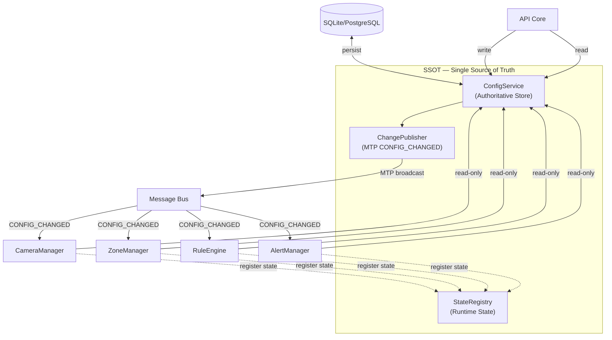
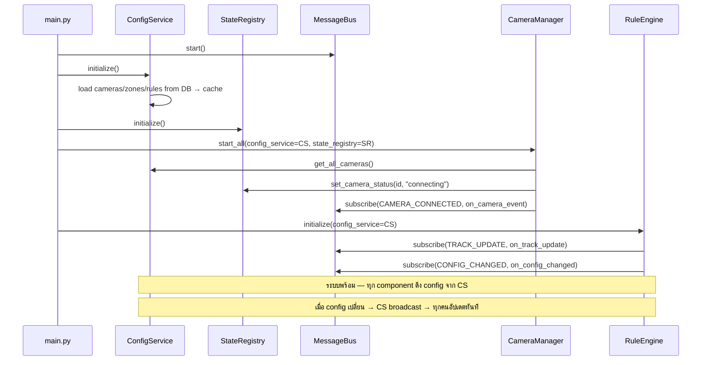

# 03 — SSOT & Configuration Management
### Single Source of Truth · ConfigService · Change Propagation

---

## 1. ปัญหาที่ SSOT แก้

ใน distributed system (แม้แต่ single-host) มีคำถามที่ตอบยาก:

```
"Zone ที่ RuleEngine ใช้อยู่ตอนนี้ — ตรงกับที่ Admin เพิ่งแก้ใน Web UI ไหม?"
"Camera fps_target ที่ CameraThread ใช้ — ตรงกับ DB ไหม?"
"Rule cooldown ที่ AlertManager cache ไว้ — ยังเป็นค่าล่าสุดไหม?"
```

ถ้าแต่ละ component เก็บ copy ของ config เอง — คำถามนี้ตอบไม่ได้
**SSOT ตอบว่า: มีที่เดียวที่ถือ "ความจริง" — ทุกคนต้องมาหาจากที่นี่**

---

## 2. SSOT Architecture



---

## 3. ConfigService

### 3.1 ความรับผิดชอบ

```
ConfigService ถือข้อมูล:
  ├── Camera configs (rtsp_url, fps_target, is_active)
  ├── Zone configs (coords, zone_type, color)
  ├── Rule configs (rule_type, threshold, cooldown, schedule)
  ├── System settings (model_path, device, thresholds)
  └── Notification settings (LINE token, SMTP, webhook URL)

ConfigService ไม่ถือ:
  ├── Runtime state (camera online/offline) → StateRegistry
  ├── Event history → Database (events table)
  └── Alert cooldown → Redis / TTLCache
```

### 3.2 Implementation

```python
# ssot/config_service.py
import asyncio
from typing import Any
from sqlalchemy.ext.asyncio import AsyncSession
from models import Camera, Zone, Rule
from protocol.mtp import MTPMessage, MTPMsgType, MTPPriority

class ConfigService:
    """
    Single Source of Truth for all configuration.
    
    Read path  : in-memory cache (fast, refreshed on CONFIG_CHANGED)
    Write path : DB first, then publish MTP CONFIG_CHANGED
    """

    def __init__(self, db_session_factory, bus):
        self._db    = db_session_factory
        self._bus   = bus
        self._cache: dict[str, Any] = {}
        self._lock  = asyncio.Lock()

    async def initialize(self) -> None:
        """โหลด config ทั้งหมดจาก DB เข้า cache ตอนเริ่มระบบ"""
        async with self._db() as session:
            cameras = await session.execute(select(Camera).where(Camera.is_active))
            zones   = await session.execute(select(Zone).where(Zone.is_active))
            rules   = await session.execute(select(Rule).where(Rule.is_active))

            self._cache["cameras"] = {c.id: c for c in cameras.scalars()}
            self._cache["zones"]   = {z.id: z for z in zones.scalars()}
            self._cache["rules"]   = {r.id: r for r in rules.scalars()}

    # ── Read (fast — from cache) ──────────────────────────────────
    def get_camera(self, camera_id: int) -> Camera | None:
        return self._cache.get("cameras", {}).get(camera_id)

    def get_all_cameras(self) -> list[Camera]:
        return list(self._cache.get("cameras", {}).values())

    def get_zones_for_camera(self, camera_id: int) -> list[Zone]:
        return [z for z in self._cache.get("zones", {}).values()
                if z.camera_id == camera_id]

    def get_rules_for_zone(self, zone_id: int) -> list[Rule]:
        return [r for r in self._cache.get("rules", {}).values()
                if r.zone_id == zone_id]

    # ── Write (DB → cache → publish) ─────────────────────────────
    async def update_zone(self, zone_id: int, changes: dict, actor: str) -> Zone:
        async with self._lock:
            async with self._db() as session:
                zone = await session.get(Zone, zone_id)
                old_values = {k: getattr(zone, k) for k in changes}
                for field, value in changes.items():
                    setattr(zone, field, value)
                await session.commit()
                await session.refresh(zone)

            # Update cache
            self._cache["zones"][zone_id] = zone

            # Publish change — ทุก subscriber รับทันที
            await self._bus.publish(MTPMessage(
                msg_type = MTPMsgType.CONFIG_CHANGED,
                source   = "ssot.config_service",
                priority = MTPPriority.HIGH,
                payload  = {
                    "scope":      "zone",
                    "entity_id":  zone_id,
                    "changed_by": actor,
                    "changes":    {k: {"old": old_values[k], "new": changes[k]}
                                   for k in changes},
                }
            ))
            return zone
```

---

## 4. StateRegistry — Runtime State

```python
# ssot/state_registry.py
import time
from dataclasses import dataclass, field
from enum import Enum

class ServiceStatus(str, Enum):
    STARTING  = "starting"
    OK        = "ok"
    DEGRADED  = "degraded"
    ERROR     = "error"
    OFFLINE   = "offline"

@dataclass
class CameraState:
    camera_id:      int
    status:         str = "offline"    # online|offline|reconnecting|error
    last_frame_at:  float = 0.0
    fps_actual:     float = 0.0
    reconnect_count: int  = 0

@dataclass
class ServiceState:
    name:       str
    status:     ServiceStatus = ServiceStatus.STARTING
    metrics:    dict = field(default_factory=dict)
    last_beat:  float = field(default_factory=time.time)

    def is_stale(self, timeout: float = 30.0) -> bool:
        return time.time() - self.last_beat > timeout

class StateRegistry:
    """
    Runtime state ของระบบ — ไม่ persist ลง DB
    Reset ทุกครั้งที่ restart
    """

    def __init__(self):
        self._cameras:  dict[int, CameraState]  = {}
        self._services: dict[str, ServiceState] = {}

    # Camera state
    def set_camera_status(self, camera_id: int, status: str, **kwargs):
        if camera_id not in self._cameras:
            self._cameras[camera_id] = CameraState(camera_id)
        state = self._cameras[camera_id]
        state.status = status
        for k, v in kwargs.items():
            setattr(state, k, v)

    def get_camera_state(self, camera_id: int) -> CameraState | None:
        return self._cameras.get(camera_id)

    def get_all_camera_states(self) -> list[CameraState]:
        return list(self._cameras.values())

    # Service health
    def heartbeat(self, service_name: str, status: ServiceStatus, metrics: dict):
        self._services[service_name] = ServiceState(
            name    = service_name,
            status  = status,
            metrics = metrics,
            last_beat = time.time(),
        )

    def get_system_health(self) -> dict:
        cameras_online  = sum(1 for c in self._cameras.values() if c.status == "online")
        cameras_total   = len(self._cameras)
        stale_services  = [s for s in self._services.values() if s.is_stale()]
        overall = "ok" if not stale_services else "degraded"

        return {
            "overall": overall,
            "cameras": {"online": cameras_online, "total": cameras_total},
            "services": {
                name: {"status": s.status, "metrics": s.metrics}
                for name, s in self._services.items()
            },
            "stale_services": [s.name for s in stale_services],
        }
```

---

## 5. Change Propagation Pattern

เมื่อ Admin แก้ Rule ผ่าน Web UI สิ่งที่เกิดขึ้น:

```
1. Admin → POST /api/rules/{id}  (REST)
2. API Core → ConfigService.update_rule(rule_id, changes, actor="admin_1")
3. ConfigService → DB.UPDATE rules  (persist first)
4. ConfigService → cache["rules"][rule_id] = updated_rule
5. ConfigService → bus.publish(CONFIG_CHANGED{scope="rule", entity_id=rule_id})
6. RuleEngine ← on_config_changed(msg)  (subscriber)
   → ไม่ต้อง reload — อ่านจาก ConfigService.get_rules_for_zone() ซึ่งดึงจาก cache
7. AlertManager ← on_config_changed(msg)
   → reset cooldown ถ้า cooldown_sec เปลี่ยน

ผลลัพธ์: Rule ใหม่มีผลภายใน < 100ms โดยไม่ restart
```

---

## 6. System Settings (Static Config)

config ที่ไม่เปลี่ยนระหว่าง runtime — อ่านจาก `.env` ตอน startup เท่านั้น:

```python
# ssot/system_config.py  (Pydantic BaseSettings)
class SystemConfig:
    # เหล่านี้ไม่ผ่าน ConfigService — เป็น static
    database_url:    str    # ต้อง restart เพื่อเปลี่ยน
    redis_url:       str
    model_path:      str
    device:          str    # CPU|GPU
    snapshot_dir:    str

# เหล่านี้ผ่าน ConfigService — เปลี่ยนได้ runtime
class RuntimeConfig:
    conf_threshold:  float  # ปรับ confidence ได้ live
    iou_threshold:   float
    fps_target:      int    # per camera — อยู่ใน Camera model
    cooldown_sec:    int    # per rule — อยู่ใน Rule model
```

---

## 7. SSOT Initialization Sequence


