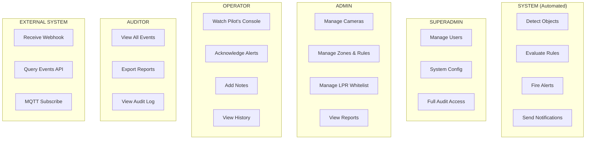

# 04 — Actors & Use Cases
### Actor Model · Use Cases per Actor · Permission Matrix · Audit Trail

---

## 1. Actor Hierarchy

```
                    ┌─────────────────────┐
                    │  GLOBAL ACTOR        │ ← สิทธิ์สูงสุด (System Owner)
                    │  (System + Superadmin)│
                    └─────────┬───────────┘
                              │
              ┌───────────────┼───────────────┐
              │               │               │
     ┌────────▼──────┐ ┌──────▼──────┐ ┌─────▼───────┐
     │  SYSTEM ACTOR  │ │  SUPERADMIN │ │   ADMIN     │
     │  (Automated)   │ │  (Human)    │ │  (Human)    │
     └───────────────┘ └─────────────┘ └──────┬──────┘
                                               │
                              ┌────────────────┼────────────────┐
                              │                │                │
                     ┌────────▼──────┐ ┌───────▼─────┐ ┌───────▼──────┐
                     │   OPERATOR    │ │   AUDITOR   │ │  EXT SYSTEM  │
                     │   (Human)     │ │   (Human)   │ │  (Machine)   │
                     └───────────────┘ └─────────────┘ └──────────────┘
```

---

## 2. Actor Definitions

### SYSTEM (Automated Actor)
```
ตัวตน    : ระบบ AI เอง — ไม่ใช่มนุษย์
ทำงาน    : ตลอด 24/7 โดยอัตโนมัติ
ใช้งาน  : Inference, Rule evaluation, Alert dispatch
สิทธิ์  : อ่าน config ทั้งหมด, เขียน events/notifications เท่านั้น
          ห้ามแก้ cameras/zones/rules
Token    : Internal service token (ไม่ expire)
```

### GLOBAL / SUPERADMIN
```
ตัวตน    : เจ้าของระบบ / System architect
ทำงาน    : ตั้งค่าระบบระดับสูง, manage users, view everything
สิทธิ์  : ทุกอย่างไม่มีข้อยกเว้น รวมถึง:
          - สร้าง/ลบ Admin accounts
          - แก้ System-level config (.env equivalent)
          - ดู audit logs ทั้งหมด
          - Force-expire alerts
          - Export ข้อมูลทั้งหมด
```

### ADMIN
```
ตัวตน    : ผู้ดูแลระบบ Security (เช่น หัวหน้า รปภ., IT Manager)
ทำงาน    : จัดการกล้อง โซน กฎ — ไม่ manage users
สิทธิ์  : CRUD cameras, zones, rules, LPR whitelist
          ดู events ทั้งหมด, export reports
          ไม่สามารถ: แก้ system config, manage user accounts
```

### OPERATOR
```
ตัวตน    : รปภ., เจ้าหน้าที่ดูจอ (Security Guard / Monitor)
ทำงาน    : ดู Pilot's Console, รับ alerts, acknowledge, ดำเนินการ
สิทธิ์  : อ่าน live feed, event log, ตรวจสอบ alerts
          Acknowledge alert (mark as reviewed)
          Silence alert ชั่วคราว (extend cooldown)
          ไม่สามารถ: แก้ cameras/zones/rules/config ใดๆ
```

### AUDITOR
```
ตัวตน    : ผู้ตรวจสอบ (Internal Audit, Compliance Officer)
ทำงาน    : ดูรายงาน, ตรวจสอบประวัติ — ไม่สามารถทำอะไรกับระบบ
สิทธิ์  : Read-only ทุกอย่าง รวมถึง audit logs
          Export events, reports, statistics
          ดู snapshots
          ไม่สามารถ: แก้อะไรก็ตาม, acknowledge alerts
```

### EXTERNAL SYSTEM (API Client)
```
ตัวตน    : ระบบภายนอก เช่น ระบบควบคุมประตู, ERP, Monitoring Platform
ทำงาน    : Subscribe alerts, Query events, Push camera status
สิทธิ์  : กำหนดต่อ API Key (scoped permissions)
          ตัวอย่าง: ระบบประตู → รับ ALERT_FIRED เท่านั้น
          ตัวอย่าง: ERP → query events ได้, ส่ง LPR whitelist update ได้
```

---

## 3. Use Cases per Actor

### UC-SYSTEM: System (Automated)

| UC ID | Use Case | Trigger | Output |
|-------|----------|---------|--------|
| SYS-01 | Capture frame from camera | Every N ms | Frame in buffer |
| SYS-02 | Run object detection | Frame available | Detection list |
| SYS-03 | Update object tracks | Detection list | Track updates |
| SYS-04 | Evaluate rules against tracks | Track update | Rule events |
| SYS-05 | Fire alert (pass debounce) | Rule event | Alert + Snapshot |
| SYS-06 | Send notifications | Alert fired | LINE/Email/Webhook |
| SYS-07 | Auto-reconnect camera | Camera disconnected | Reconnect attempt |
| SYS-08 | Publish health heartbeat | Every 10s | HEALTH_BEAT message |
| SYS-09 | Purge old snapshots | Daily cron | Freed disk space |

---

### UC-SUPERADMIN: Global Actor

| UC ID | Use Case | คำอธิบาย |
|-------|----------|----------|
| SA-01 | Manage user accounts | สร้าง/แก้/ปิด Admin, Operator, Auditor accounts |
| SA-02 | Configure system settings | แก้ AI model, device, thresholds, retention policy |
| SA-03 | View full audit log | ดู log ทุก action ของทุก actor |
| SA-04 | Export all data | Export events, configs, snapshots ทั้งหมด |
| SA-05 | Emergency system shutdown | หยุดการทำงานทั้งระบบอย่างปลอดภัย |
| SA-06 | Override alert cooldown | Force-reset cooldown เมื่อมีเหตุฉุกเฉิน |
| SA-07 | Switch database | เปลี่ยน SQLite → PostgreSQL |
| SA-08 | View system health (all) | ดู health ทุก service, resource usage |

---

### UC-ADMIN: Admin

| UC ID | Use Case | คำอธิบาย |
|-------|----------|----------|
| ADM-01 | Add camera | เพิ่มกล้องใหม่ด้วย RTSP URL, ตั้งชื่อและ location |
| ADM-02 | Edit camera settings | แก้ fps_target, ปิด/เปิดกล้อง |
| ADM-03 | Test camera connection | ทดสอบ RTSP URL ก่อน save |
| ADM-04 | Draw zone on camera | วาด Polygon หรือ Tripwire บนภาพกล้อง |
| ADM-05 | Configure zone rule | ตั้ง rule_type, target_class, threshold, cooldown |
| ADM-06 | Set schedule for rule | กำหนดเวลาที่ rule ทำงาน (Day/Night mode) |
| ADM-07 | Manage LPR whitelist | เพิ่ม/ลบ/แก้ ทะเบียนรถที่อนุญาต |
| ADM-08 | Configure notifications | ตั้ง LINE token, SMTP, Webhook URL |
| ADM-09 | View all events | ดู event log พร้อม filter และ search |
| ADM-10 | View analytics | ดู heatmap, hourly stats, camera performance |
| ADM-11 | Export event report | Export CSV/PDF ช่วงเวลาที่กำหนด |
| ADM-12 | Assign camera to operator | กำหนดกล้องที่ operator มองเห็น |

---

### UC-OPERATOR: Operator

| UC ID | Use Case | คำอธิบาย |
|-------|----------|----------|
| OPR-01 | View Pilot's Console | ดู live feed กล้องที่ได้รับมอบหมาย + alert queue |
| OPR-02 | Watch live camera feed | ดูภาพ real-time พร้อม bounding box และ zone |
| OPR-03 | Receive alert notification | รับ alert popup บน Console พร้อม snapshot |
| OPR-04 | Acknowledge alert | Mark alert ว่า "รับทราบ / กำลังดำเนินการ" |
| OPR-05 | Add note to alert | บันทึกหมายเหตุ (เช่น "ส่ง รปภ. ไปตรวจแล้ว") |
| OPR-06 | Silence alert (temporary) | ขยาย cooldown ชั่วคราว (เช่น มีงานกิจกรรม) |
| OPR-07 | View event history | ดู events ย้อนหลังของกล้องที่ดูแล |
| OPR-08 | View snapshot | ดูภาพ snapshot ของแต่ละ event |
| OPR-09 | Escalate alert | ส่ง alert ไปยัง supervisor |

---

### UC-AUDITOR: Auditor

| UC ID | Use Case | คำอธิบาย |
|-------|----------|----------|
| AUD-01 | View event history (all cameras) | ดู events ทั้งหมด ทุกกล้อง |
| AUD-02 | Search events | ค้นหาด้วย camera, type, date range, object class |
| AUD-03 | View snapshots | ดูภาพประกอบทุก event |
| AUD-04 | View audit log | ดูว่า actor ไหนทำอะไรเมื่อไหร่ |
| AUD-05 | Export report | Export CSV, PDF สำหรับรายงานประจำเดือน |
| AUD-06 | View alert statistics | สถิติ alert per camera, per rule, per period |
| AUD-07 | Verify alert acknowledgment | ตรวจสอบว่า operator ได้ acknowledge ครบหรือไม่ |

---

### UC-EXT: External System

| UC ID | Use Case | คำอธิบาย |
|-------|----------|----------|
| EXT-01 | Receive alert webhook | รับ POST เมื่อ alert fired (ตั้งค่าโดย Admin) |
| EXT-02 | Query events via API | GET /api/events/ พร้อม filter (ต้องมี API Key) |
| EXT-03 | Push LPR update | POST /api/lpr/whitelist/ (ถ้าได้รับสิทธิ์) |
| EXT-04 | Subscribe MQTT alerts | Subscribe topic mtsecurity/alerts/# |
| EXT-05 | Query camera status | GET /api/cameras/{id}/status |

---

## 4. Permission Matrix

```
                  SYSTEM  SUPERADMIN  ADMIN  OPERATOR  AUDITOR  EXT_SYS
─────────────────────────────────────────────────────────────────────────
cameras: read       ✓        ✓         ✓       ✓*        ✓*       ✓*
cameras: write      ✗        ✓         ✓       ✗         ✗        ✗
zones: read         ✓        ✓         ✓       ✓*        ✓*       ✗
zones: write        ✗        ✓         ✓       ✗         ✗        ✗
rules: read         ✓        ✓         ✓       ✗         ✗        ✗
rules: write        ✗        ✓         ✓       ✗         ✗        ✗
events: read        ✗        ✓         ✓       ✓*        ✓        ✓*
events: write       ✓        ✓         ✗       ✗         ✗        ✗
alerts: acknowledge ✗        ✓         ✓       ✓         ✗        ✗
alerts: silence     ✗        ✓         ✓       ✓*        ✗        ✗
lpr_whitelist: CRUD ✗        ✓         ✓       ✗         ✗        ✓*
users: manage       ✗        ✓         ✗       ✗         ✗        ✗
audit_log: read     ✗        ✓         ✗       ✗         ✓        ✗
system: config      ✗        ✓         ✗       ✗         ✗        ✗
export: data        ✗        ✓         ✓       ✗         ✓        ✗
live_feed: view     ✗        ✓         ✓       ✓*        ✗        ✗

✓  = full access
✓* = scoped access (เฉพาะที่ได้รับมอบหมาย หรือเฉพาะ scope ที่ API Key อนุญาต)
✗  = ไม่มีสิทธิ์
```

---

## 5. Authentication & Session

```python
# auth/token.py — JWT-based

class TokenType(str, Enum):
    ACCESS   = "access"    # expire 8 ชั่วโมง (human actors)
    REFRESH  = "refresh"   # expire 30 วัน
    API_KEY  = "api_key"   # expire ตามที่ Admin กำหนด (external system)
    INTERNAL = "internal"  # ไม่ expire (SYSTEM actor)

class TokenPayload(BaseModel):
    sub:        str          # actor identifier
    actor_type: str          # "system"|"superadmin"|"admin"|"operator"|"auditor"|"ext"
    scopes:     list[str]    # ["cameras:read","events:read","alerts:acknowledge"]
    camera_ids: list[int]    # [] = all cameras, [1,3,5] = scoped
    exp:        int          # expiry unix timestamp
```

---

## 6. Audit Log

**ทุก action ของ human actor และ external system ต้องมี audit record**
SYSTEM actor ไม่ audit (มากเกินไป) แต่ SYSTEM events ดูได้จาก events table

```python
# models/audit_log.py
class AuditLog(Base):
    __tablename__ = "audit_logs"

    id:          Mapped[int]  = mapped_column(BigInteger, primary_key=True, autoincrement=True)
    actor_id:    Mapped[str]  = mapped_column(String(100))   # "admin_1", "ext_doorctrl"
    actor_type:  Mapped[str]  = mapped_column(String(20))
    action:      Mapped[str]  = mapped_column(String(100))   # "zone.update", "alert.acknowledge"
    resource:    Mapped[str]  = mapped_column(String(100))   # "zone/15", "alert/1234"
    changes:     Mapped[dict | None] = mapped_column(JSON)   # before/after
    ip_address:  Mapped[str | None]  = mapped_column(String(45))
    user_agent:  Mapped[str | None]  = mapped_column(String(200))
    timestamp:   Mapped[datetime]    = mapped_column(DateTime(timezone=True), default=utcnow, index=True)
    result:      Mapped[str]  = mapped_column(String(20))    # "success"|"denied"|"error"
```

---

## 7. Use Case Diagram (Summary)


