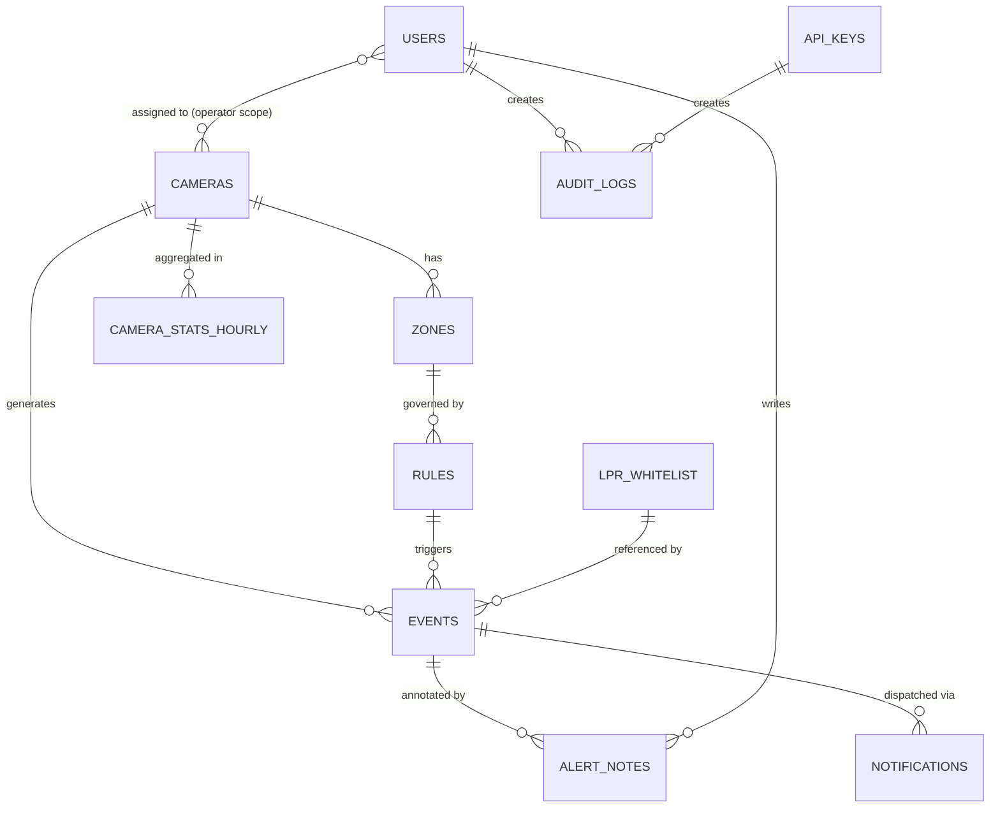

# 06 — Domain Model (v2)
### Updated for: MTP, SSOT, Actors, Audit Log

---

## 1. Entity Relationship Diagram



---

## 2. Full SQLAlchemy Model Set

### models/user.py — Actor Management

```python
from sqlalchemy import String, Integer, Boolean, DateTime, JSON
from sqlalchemy.orm import Mapped, mapped_column, relationship
from .base import Base, utcnow

class User(Base):
    __tablename__ = "users"
    __table_args__ = (
        CheckConstraint(
            "actor_type IN ('superadmin','admin','operator','auditor')",
            name="valid_actor_type"
        ),
    )

    id:          Mapped[int]  = mapped_column(Integer, primary_key=True, autoincrement=True)
    username:    Mapped[str]  = mapped_column(String(50), unique=True, nullable=False)
    display_name: Mapped[str] = mapped_column(String(100), nullable=False)
    hashed_password: Mapped[str] = mapped_column(String(200), nullable=False)
    actor_type:  Mapped[str]  = mapped_column(String(20), nullable=False)
    # camera_ids: [] = all cameras, [1,3,5] = scoped (for operator)
    camera_ids:  Mapped[list] = mapped_column(JSON, default=list)
    is_active:   Mapped[bool] = mapped_column(Boolean, default=True)
    last_login:  Mapped[datetime | None] = mapped_column(DateTime(timezone=True))
    created_at:  Mapped[datetime] = mapped_column(DateTime(timezone=True), default=utcnow)
    created_by:  Mapped[str | None] = mapped_column(String(50))

    audit_logs:  Mapped[list["AuditLog"]] = relationship("AuditLog", back_populates="user")
    notes:       Mapped[list["AlertNote"]] = relationship("AlertNote", back_populates="user")

class APIKey(Base):
    __tablename__ = "api_keys"

    id:          Mapped[int]  = mapped_column(Integer, primary_key=True, autoincrement=True)
    name:        Mapped[str]  = mapped_column(String(100), nullable=False)
    key_hash:    Mapped[str]  = mapped_column(String(200), unique=True)
    # scopes: ["events:read", "lpr:write", "alerts:subscribe"]
    scopes:      Mapped[list] = mapped_column(JSON, default=list)
    camera_ids:  Mapped[list] = mapped_column(JSON, default=list)
    is_active:   Mapped[bool] = mapped_column(Boolean, default=True)
    expires_at:  Mapped[datetime | None] = mapped_column(DateTime(timezone=True))
    created_by:  Mapped[str]  = mapped_column(String(50))
    created_at:  Mapped[datetime] = mapped_column(DateTime(timezone=True), default=utcnow)
```

### models/audit_log.py

```python
class AuditLog(Base):
    __tablename__ = "audit_logs"

    id:          Mapped[int]  = mapped_column(BigInteger, primary_key=True, autoincrement=True)
    actor_id:    Mapped[str]  = mapped_column(String(100), nullable=False)
    actor_type:  Mapped[str]  = mapped_column(String(20),  nullable=False)
    action:      Mapped[str]  = mapped_column(String(100), nullable=False, index=True)
    resource:    Mapped[str]  = mapped_column(String(200))
    changes:     Mapped[dict | None] = mapped_column(JSON)
    ip_address:  Mapped[str | None]  = mapped_column(String(45))
    result:      Mapped[str]  = mapped_column(String(20), default="success")
    timestamp:   Mapped[datetime] = mapped_column(
        DateTime(timezone=True), default=utcnow, index=True
    )
    user_id:     Mapped[int | None] = mapped_column(ForeignKey("users.id"))
    user:        Mapped["User | None"] = relationship("User", back_populates="audit_logs")
```

### models/alert_note.py

```python
class AlertNote(Base):
    __tablename__ = "alert_notes"

    id:         Mapped[int]  = mapped_column(Integer, primary_key=True, autoincrement=True)
    event_id:   Mapped[int]  = mapped_column(ForeignKey("events.id"), nullable=False, index=True)
    user_id:    Mapped[int]  = mapped_column(ForeignKey("users.id"), nullable=False)
    note:       Mapped[str]  = mapped_column(String(1000), nullable=False)
    action:     Mapped[str]  = mapped_column(String(30), default="note")
    # action: "note"|"acknowledge"|"escalate"|"silence"
    created_at: Mapped[datetime] = mapped_column(DateTime(timezone=True), default=utcnow)

    event: Mapped["Event"] = relationship("Event", back_populates="notes")
    user:  Mapped["User"]  = relationship("User",  back_populates="notes")
```

### models/event.py (updated)

```python
class Event(Base):
    __tablename__ = "events"

    # ... (fields เหมือนเดิม) ...

    # เพิ่มใหม่สำหรับ v2
    acknowledged_by:  Mapped[int | None]   = mapped_column(ForeignKey("users.id"))
    acknowledged_at:  Mapped[datetime | None] = mapped_column(DateTime(timezone=True))
    is_acknowledged:  Mapped[bool]         = mapped_column(Boolean, default=False)
    silenced_until:   Mapped[datetime | None] = mapped_column(DateTime(timezone=True))
    mtp_correlation:  Mapped[str | None]   = mapped_column(String(36))  # MTP correlation_id

    notes: Mapped[list["AlertNote"]] = relationship("AlertNote", back_populates="event")
```

---

## 3. Database Schema (Complete — All Tables)

```sql
-- SQLite compatible (JSON แทน JSONB, TEXT แทน VARCHAR length limits)
-- ทุก table สร้างผ่าน SQLAlchemy + Alembic migration

Tables:
  cameras              ← กล้องทุกตัว
  zones                ← โซนและเส้นสมมติ
  rules                ← กฎต่อโซน
  events               ← เหตุการณ์ที่ตรวจพบ
  notifications        ← การแจ้งเตือนออกไป
  lpr_whitelist        ← ทะเบียนรถที่อนุญาต
  users                ← ผู้ใช้งานระบบ (human actors)
  api_keys             ← API keys สำหรับ external system
  audit_logs           ← ทุก action ของทุก actor
  alert_notes          ← หมายเหตุ/การดำเนินการต่อ alert
  camera_stats_hourly  ← สถิติรายชั่วโมง (analytics)
```

---

## 4. Updated Pydantic Schemas (API Contracts)

```python
# schemas/zone.py
class ZoneCreate(BaseModel):
    camera_id:  int
    name:       str = Field(..., min_length=1, max_length=100)
    zone_type:  Literal["polygon", "tripwire"]
    # coords normalized 0.0–1.0 relative to frame size
    coords:     list[list[float]] = Field(..., min_length=3)
    color_hex:  str = Field(default="#FF0000", pattern=r"^#[0-9A-Fa-f]{6}$")

    @field_validator("coords")
    @classmethod
    def validate_coords(cls, v):
        for point in v:
            if len(point) != 2:
                raise ValueError("Each coord must be [x, y]")
            if not (0.0 <= point[0] <= 1.0 and 0.0 <= point[1] <= 1.0):
                raise ValueError("Coords must be normalized 0.0–1.0")
        return v

class ZoneRead(BaseModel):
    model_config = ConfigDict(from_attributes=True)
    id: int
    camera_id: int
    name: str
    zone_type: str
    coords: list[list[float]]
    color_hex: str
    is_active: bool
    rules: list["RuleRead"] = []

# schemas/event.py
class EventRead(BaseModel):
    model_config = ConfigDict(from_attributes=True)
    id: int
    camera_id: int
    zone_id: int | None
    event_type: str
    track_id: int | None
    object_class: str | None
    confidence: float | None
    bbox: dict | None
    dwell_time: float | None
    extra_data: dict | None
    snapshot_path: str | None
    is_alerted: bool
    is_acknowledged: bool
    acknowledged_at: datetime | None
    occurred_at: datetime
    notes: list["AlertNoteRead"] = []

class EventFilter(BaseModel):
    camera_id:   int | None = None
    event_type:  str | None = None
    object_class: str | None = None
    date_from:   datetime | None = None
    date_to:     datetime | None = None
    is_alerted:  bool | None = None
    is_acknowledged: bool | None = None
    limit:       int = Field(default=50, le=500)
    offset:      int = Field(default=0, ge=0)
```

---

## 5. Indexes Strategy (SQLite → PostgreSQL)

```sql
-- Events table (ตาราง query บ่อยที่สุด)
CREATE INDEX ix_events_camera_occurred  ON events(camera_id, occurred_at DESC);
CREATE INDEX ix_events_type_occurred    ON events(event_type, occurred_at DESC);
CREATE INDEX ix_events_alerted          ON events(occurred_at DESC)
                                         WHERE is_alerted = 1;     -- SQLite
                                         -- WHERE is_alerted = TRUE; -- PostgreSQL
CREATE INDEX ix_events_acknowledged     ON events(is_acknowledged, occurred_at DESC);
CREATE INDEX ix_events_mtp_correlation  ON events(mtp_correlation);

-- Audit logs
CREATE INDEX ix_audit_actor_time    ON audit_logs(actor_id, timestamp DESC);
CREATE INDEX ix_audit_action_time   ON audit_logs(action, timestamp DESC);

-- SQLite NOTE: Partial indexes (WHERE clause) รองรับตั้งแต่ SQLite 3.8.9
-- ระวัง: JSONB operators (@>, ?) ใช้ใน PostgreSQL เท่านั้น
--        ใน SQLite ต้อง query แบบ LIKE หรือ json_extract()
```
