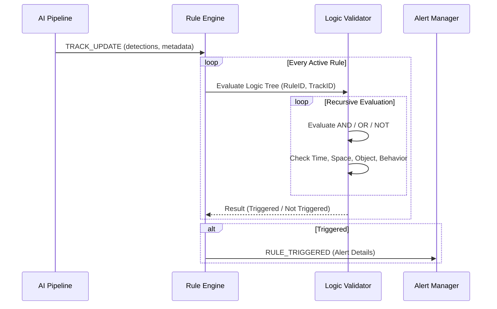

# 02 — Rule Logic Specification (Advanced Security Policies)

เอกสารฉบับนี้กำหนดรายละเอียดทางเทคนิคของระบบการประเมินผลกฎ (Rule Evaluation) แบบใหม่ที่รองรับตรรกะซับซ้อน

---

## 1. Logic Tree Structure (JSON)

เราจะใช้โครงสร้างแบบ **Abstract Syntax Tree (AST)** เพื่อเก็บเงื่อนไขในรูปแบบ JSON ในตาราง `rules`

### ตัวอย่างโครงสร้าง:
```json
{
  "operator": "AND",
  "conditions": [
    {
      "type": "time",
      "params": { "schedule_id": 5 }
    },
    {
      "operator": "OR",
      "conditions": [
        {
          "type": "behavior",
          "params": { "type": "intrusion", "zone_id": 10 }
        },
        {
          "type": "behavior",
          "params": { "type": "loitering", "zone_id": 10, "seconds": 60 }
        }
      ]
    },
    {
      "type": "object",
      "params": { "class": "person", "confidence": 0.7 }
    }
  ]
}
```

---

## 2. Condition Types (มิติของเงื่อนไข)

### 2.1 Time Condition (`type: "time"`)
*   **Source:** ดึงข้อมูลจาก `ScheduleManager`
*   **Logic:** ตรวจสอบว่า `current_time` อยู่ในห่วงเวลาที่กำหนดหรือไม่

### 2.2 Space Condition (`type: "space"`)
*   **Source:** ดึงข้อมูลจาก `ZoneManager`
*   **Logic:** ตรวจสอบว่าพิกัดของวัตถุ (Centroid) อยู่ในพื้นที่ที่ระบุหรือไม่

### 2.3 Object Condition (`type: "object"`)
*   **Source:** ตรวจสอบจาก Metadata ของ Track
*   **Logic:** เช็ค Class (Person/Vehicle), Confidence และ Attributes (เช่น License Plate)

### 2.4 Behavior Condition (`type: "behavior"`)
*   **Source:** ดึงข้อมูลจาก `BEHAVIOR_REGISTRY` และ `DwellTracker`
*   **Logic:** ตรวจสอบพฤติกรรมเฉพาะตัวของวัตถุนั้นๆ

---

## 3. Evaluation Flow (ลำดับการประมวลผล)



---

## 4. Why This Architecture? (ทำไมต้องสถาปัตยกรรมนี้?)

1.  **Flexibility:** ผู้ใช้สามารถสร้างกฎที่ซับซ้อนมากได้โดยไม่ต้องเขียนโค้ดเพิ่ม
2.  **Maintainability:** การแยก Logic Validator ออกจากตัว Engine หลักช่วยให้การแก้ไขโค้ดทำได้ง่ายและไม่กระทบส่วนอื่น
3.  **Scalability:** สามารถเพิ่ม Condition Type ใหม่ๆ ได้ในอนาคต (เช่น Audio Detection หรือ Thermal Alerts) โดยใช้โครงสร้างเดิม
